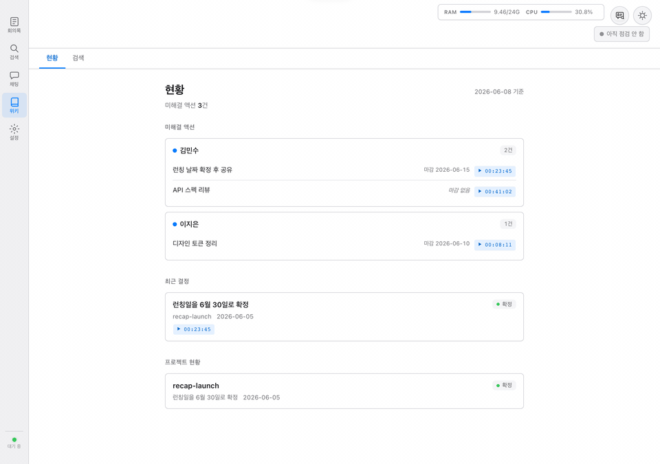
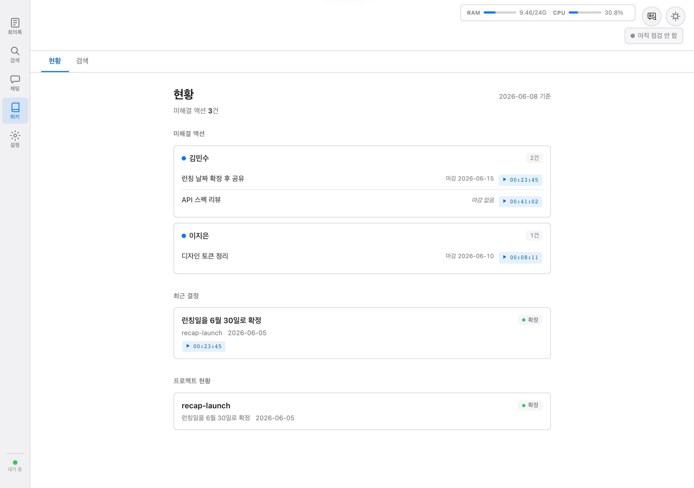
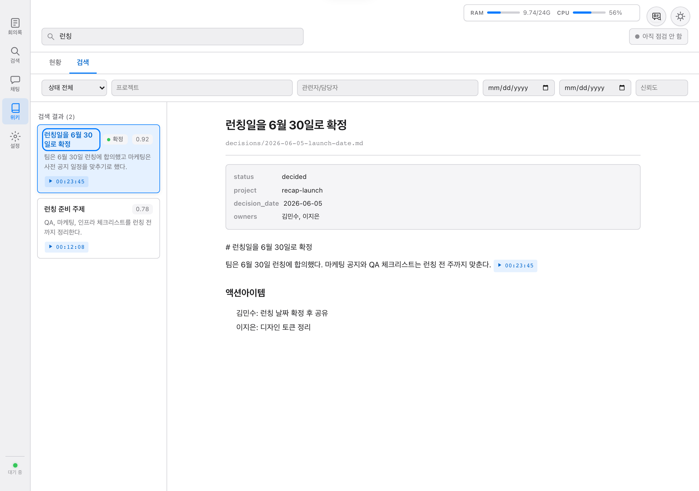

# Recap

English | [한국어](README.md)

> **A local-first meeting memory tool that turns recordings into a cited Decision Wiki.**
> _Built for Apple Silicon Macs, private meeting workflows, and teams that cannot send meeting data to external AI APIs._

[](https://github.com/notadev-iamaura/meeting-transcriber/actions/workflows/ci.yml) [](https://opensource.org/licenses/MIT) [](https://www.python.org/downloads/)

Recap runs a meeting workflow locally on Apple Silicon: recording, transcription, speaker diarization, correction, summarization, search, chat, and a Decision Wiki layer.

The core idea is simple: meetings should not end as long transcripts that nobody can find again. They should become searchable decisions, action items, and cited notes that link back to the original meeting timestamp.

All processing is designed to happen locally. Meeting audio and transcripts are not sent to external AI APIs.

> **Apple Silicon only** - Recap uses MLX and currently targets Apple Silicon Macs (M1/M2/M3/M4). Intel Mac, Linux, and Windows are not supported for the MLX-based STT path.



## Screenshots

| Decision Wiki overview | Wiki search |
|---|---|
|  |  |

## Why Decision Wiki?

Plain transcripts are hard to reuse. Summaries help, but they often lose the chain of evidence. Recap keeps the original transcript and search index, then adds a Markdown-based wiki layer for decisions, action items, projects, people, and topics.

- **Keep the source**: full transcripts and meeting-level search indexes remain available.
- **Cited decisions**: wiki entries are designed to include timestamp citations such as `[meeting:{id}@HH:MM:SS]`.
- **Hybrid search**: transcript search uses ChromaDB + SQLite FTS5; wiki search combines keyword search and vector search.
- **Operational digest**: open actions, recent decisions, and project status can be collected without another LLM call.

Recap started from a Korean-heavy meeting workflow, but the broader problem is language-independent: private meetings need a durable memory layer, not just raw transcripts.

## Features

- **Recording and transcription**: local audio workflow with mlx-whisper on Apple Silicon.
- **STT model management**: choose and manage speech recognition models from the web UI.
- **Speaker diarization**: pyannote-audio based speaker separation.
- **Local LLM correction and summarization**: MLX by default, Ollama optional.
- **Decision Wiki**: turn decisions and action items into cited Markdown notes.
- **Hybrid search**: transcript RAG search plus wiki search.
- **AI chat**: ask questions over meeting transcripts and wiki knowledge.
- **Zoom recording support**: detect Zoom meetings and record automatically.
- **BlackHole support**: capture system audio when BlackHole is installed.
- **macOS menubar app**: local app with live recording status.
- **Web UI**: SPA for meetings, viewer, search, wiki, chat, and settings.

## Requirements

| Item | Requirement |
|---|---|
| OS | macOS 14 Sonoma or later |
| Chip | Apple Silicon M1/M2/M3/M4 |
| RAM | 16GB recommended |
| Disk | 20GB free space recommended |
| Python | 3.11 or 3.12 |
| System dependency | ffmpeg |

Python 3.13+ is not recommended because ChromaDB native bindings may crash in this environment.

## Quick Start

```bash
git clone https://github.com/notadev-iamaura/meeting-transcriber.git
cd meeting-transcriber
python3 -m venv .venv
source .venv/bin/activate
pip install -e ".[dev]"
bash scripts/install.sh
```

Run the app:

```bash
python main.py
```

Run server-only mode:

```bash
python main.py --no-menubar
```

Speaker diarization uses gated pyannote models. To enable it, you need a Hugging Face account, access approval for the pyannote models, and a read token configured as `HUGGINGFACE_TOKEN` / `HF_TOKEN`.

## Positioning

Recap is intentionally narrow:

- It is not a SaaS meeting bot.
- It is not a generic enterprise knowledge base.
- It is not claiming perfect automatic meeting memory.

It is an open-source, local-first tool for people who have many meetings, need to preserve decisions, and cannot freely send meeting data to external AI services.

## Known Limits

- Apple Silicon only for now.
- Setup is heavier than a hosted SaaS app.
- Diarization requires Hugging Face gated model access.
- Decision Wiki output should be reviewed with the original timestamp citations.
- The current workflow is strongest for local/private desktop use, not multi-user hosted deployment.

## Links

- Korean README: [README.md](README.md)
- Launch copy: [docs/MARKETING_COPY.md](docs/MARKETING_COPY.md)
- Release draft: [docs/releases/v0.1.0-beta.md](docs/releases/v0.1.0-beta.md)
