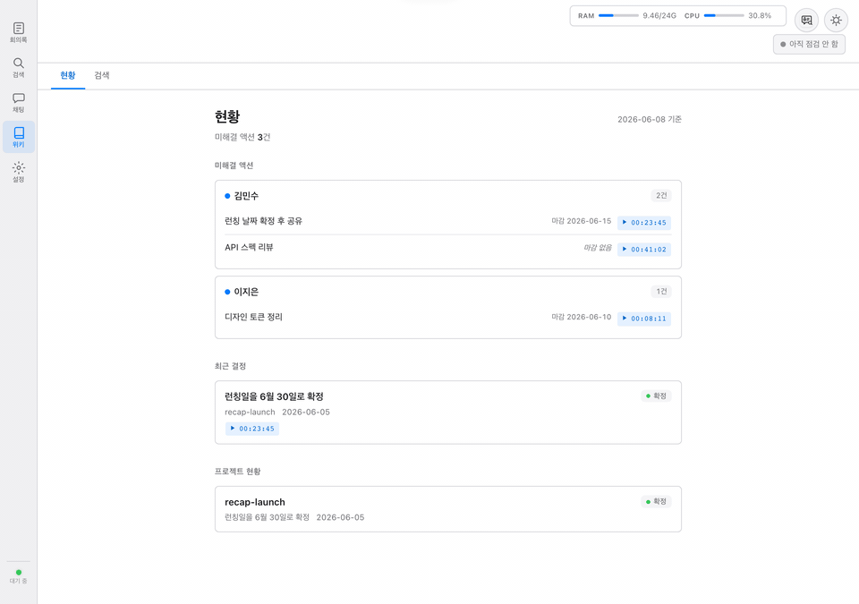
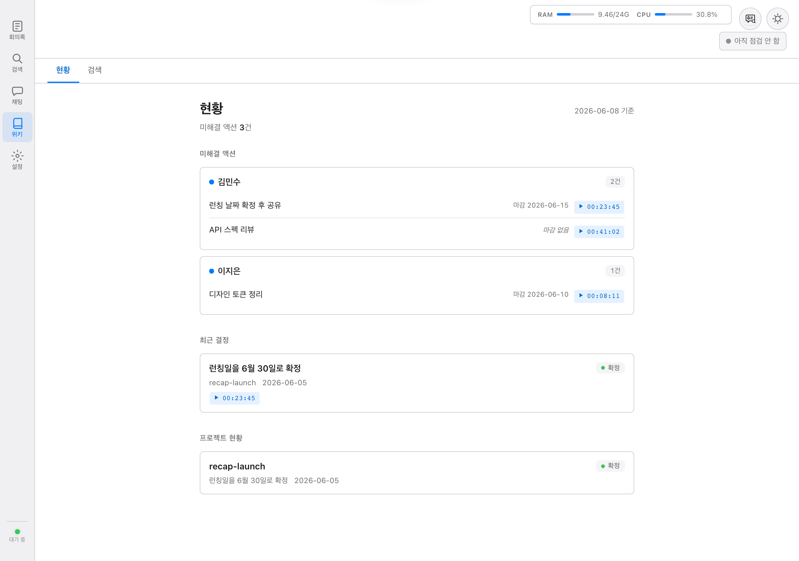
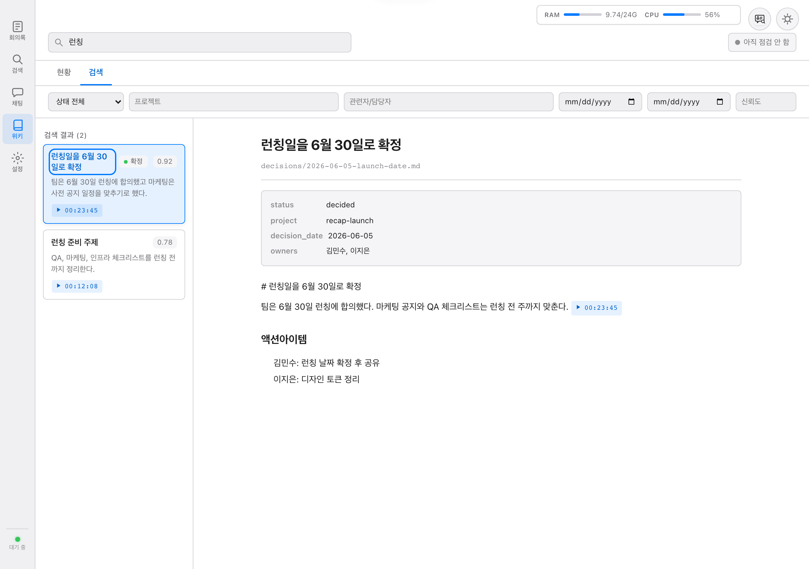

# Recap

[English](README.en.md) | 한국어

> **한국어 회의를 로컬에서 녹음하고, 검색 가능한 Decision Wiki로 남기는 도구**
> _Local Korean meeting recorder and cited Decision Wiki for Apple Silicon._

[](https://github.com/notadev-iamaura/meeting-transcriber/actions/workflows/ci.yml) [](https://opensource.org/licenses/MIT) [](https://www.python.org/downloads/)

Recap은 Apple Silicon Mac에서 회의 녹음 → 전사 → 화자 분리 → AI 교정·요약 → 검색·채팅 → Decision Wiki 정리 흐름을 기본적으로 로컬에서 처리하는 프로젝트입니다.
회의가 끝난 뒤 사라지는 대화를 결정사항, 액션아이템, 원문 timestamp 근거와 함께 다시 찾을 수 있게 만드는 것이 목표입니다.

기본 전사 모델은 로컬 `whisper-large-v3-turbo`이며 외부 전송은 없습니다. 설정에서 OpenAI를 기본값으로 선택하고 한 번 동의하면 로컬로 되돌리기 전까지 이후 새 전사 음성이 OpenAI로 전송됩니다. 회의별 비교는 실행할 때마다 별도 동의를 요구합니다. 교정·요약·검색·채팅은 계속 로컬에서 실행됩니다.

> **⚠️ Apple Silicon Mac 전용** — 이 프로젝트는 MLX 프레임워크를 사용하며, Apple Silicon(M1/M2/M3/M4) Mac에서만 동작합니다.
> Intel Mac, Linux, Windows에서는 MLX 기반 STT가 지원되지 않습니다.



## 스크린샷

| Decision Wiki 현황 | Wiki 검색 |
|---|---|
|  |  |

## 왜 Decision Wiki인가

긴 전사문은 남겨도 다시 찾기 어렵습니다. Recap은 원문 전사와 RAG 검색을 유지하면서, 회의에서 나온 결정사항과 액션아이템을 별도의 Markdown Wiki 레이어로 정리하는 흐름을 제공합니다.

- **원문 보존**: 전체 전사문과 회의별 RAG 인덱스는 그대로 유지합니다.
- **근거 인용**: Wiki에 승격되는 결정사항은 `[meeting:{id}@HH:MM:SS]` 형식의 원문 timestamp 근거를 갖도록 설계했습니다.
- **하이브리드 검색**: Wiki 검색은 BM25/FTS5 키워드 검색과 e5-small 벡터 검색을 함께 사용해, 표현이 조금 달라도 관련 결정을 찾을 수 있게 합니다.
- **업무 현황 다이제스트**: 미해결 액션, 최근 결정, 프로젝트별 현재 상태를 LLM 호출 없이 집계합니다.

Decision Wiki 기능은 설정에서 활성화해 사용하는 로컬 LLM 기반 컴파일러와 검색 인덱스를 사용합니다. 자동 생성 결과는 보수적으로 다루며, 원문 근거와 함께 확인할 수 있는 방향을 우선합니다.

## 주요 기능

- **음성 → 텍스트 변환**: 기본은 mlx-whisper 기반 로컬 한국어 STT, 선택적으로 OpenAI `gpt-4o-transcribe-diarize`
- **전사 모델 선택기**: 웹 UI에서 기본 처리 위치와 로컬 음성 인식 모델을 관리
- **회의별 다른 모델 전사**: 기존 회의록을 보존한 채 로컬/OpenAI 결과를 비파괴 A/B 작업으로 생성
- **화자 분리**: `pyannote/speaker-diarization-community-1`로 발화자별 자동 분리
- **AI 교정**: Gemma 4 (기본) 또는 EXAONE 3.5 로컬 LLM으로 전사 오류 교정 (MLX 기본, Ollama 선택 가능)
- **Decision Wiki**: 회의 결정사항과 액션아이템을 원문 timestamp 근거가 있는 Markdown Wiki로 정리
- **하이브리드 검색**: 전사문은 ChromaDB + SQLite FTS5 RAG로, Wiki는 BM25/FTS5 + e5-small 벡터 검색으로 탐색
- **AI 채팅**: 회의 원문과 Wiki 지식을 기반으로 질의응답
- **Zoom 자동 녹음**: Zoom 회의 감지 시 ffmpeg로 자동 녹음 시작/종료
- **BlackHole 지원**: 시스템 오디오 캡처 (BlackHole 설치 시 자동 전환, 미설치 시 마이크 사용)
- **macOS 메뉴바 앱**: rumps 기반 메뉴바 상주, 녹음 상태 실시간 표시
- **웹 UI**: macOS 네이티브 스타일 SPA (회의 목록 + 뷰어 + 검색 + Wiki + AI 채팅 + 준비 상태 + 설정)
- **설정 UI**: 웹에서 STT 모델/LLM 모델/Temperature/전사 언어 등 실시간 변경
- **Zoom 감지**: Zoom 회의 시작/종료 자동 감지 (CptHost 프로세스 모니터링)
- **폴더 감시**: 지정 폴더에 파일 추가 시 자동 처리
- **서멀 관리**: 팬리스 MacBook Air 대응, 2-job + 쿨다운 패턴

## 시스템 요구사항

| 항목 | 최소 사양 |
|------|-----------|
| OS | macOS 14 (Sonoma) 이상 |
| 칩 | **Apple Silicon (M1, M2, M3, M4)** — Intel Mac 미지원 |
| RAM | 16GB 이상 |
| 디스크 | 20GB 이상 여유 공간 |
| Python | **3.11 또는 3.12** (3.13 이상 미지원) |
| 기타 | ffmpeg |

> **⚠️ Python 버전 주의**: Python 3.13 이상에서는 ChromaDB의 Rust 네이티브 바인딩이 호환되지 않아 크래시가 발생할 수 있습니다. 반드시 Python 3.11 또는 3.12를 사용하세요.

> **참고**: LLM 백엔드로 Ollama 또는 MLX를 선택할 수 있습니다.
> Ollama 선택 시 별도 Ollama 앱 설치가 필요하고, MLX 선택 시 추가 설치 없이 동작합니다.

### 내 Mac에 맞는 LLM 백엔드 확인

```bash
# 칩 종류 확인
sysctl -n machdep.cpu.brand_string

# RAM 확인
echo "$(( $(sysctl -n hw.memsize) / 1073741824 ))GB"
```

| 내 Mac | 권장 설정 | 이유 |
|--------|----------|------|
| **M4 + 16GB** | MLX + Gemma 4 E4B (기본) | 최적 성능, 멀티모달, Thinking 모드 |
| **M3/M4 + 16GB 이상** | MLX + Gemma 4 E4B (기본) | 통합 메모리 네이티브, Ollama 불필요 |
| **M1/M2 + 16GB** | MLX + Gemma 4 E4B (기본) | 검증된 성능. 한국어 고유명사 정확도 우선 시 EXAONE 으로 전환 |
| **M1/M2 + 8GB** | MLX + Gemma 4 E2B 또는 Ollama | E2B는 ~3GB로 메모리 절약 |

## 빠른 시작

### AI 에이전트로 셋업 (Claude Code / Cursor)

> **가장 쉬운 방법**: AI 코딩 에이전트가 자동으로 환경을 구성합니다.

```bash
git clone https://github.com/notadev-iamaura/meeting-transcriber.git
cd meeting-transcriber
```

**Claude Code** 사용 시:
```bash
claude
# 프롬프트에 "이 프로젝트 셋업해줘" 입력
```

**Cursor** 사용 시:
- 프로젝트 폴더 열기 → Composer에 "이 프로젝트 셋업해줘" 입력

AI 에이전트가 `CLAUDE.md`를 읽고 가상환경 생성, 의존성 설치, Ollama 모델 다운로드까지 자동 처리합니다.
HuggingFace 토큰 설정 등 수동 단계는 에이전트가 안내해줍니다.

---

### 수동 셋업

### 1. 저장소 클론

```bash
git clone https://github.com/notadev-iamaura/meeting-transcriber.git
cd meeting-transcriber
```

### 2. Python 가상환경 생성

```bash
python3 -m venv .venv
source .venv/bin/activate
```

### 3. 의존성 설치

```bash
pip install -e ".[dev]"
```

### 4. 시스템 의존성 설치 (자동)

```bash
bash scripts/install.sh
```

이 스크립트가 자동으로 처리하는 항목:
- Homebrew 확인
- Python 3.11+ 확인
- ffmpeg 설치
- Ollama 확인 (Ollama 백엔드 사용 시)
- EXAONE 3.5 모델 다운로드 (Ollama 백엔드 사용 시)
- 데이터 디렉토리 생성 + 보안 설정

> **MLX 기본 환경에서는 LLM 모델이 첫 실행 시 HuggingFace 에서 자동 다운로드** 되므로 `install.sh` 의 7단계(EXAONE pull) 는 건너뛰어도 됩니다. Ollama 백엔드를 명시적으로 선택한 경우에만 필요합니다.

### 4-2. 양방향 회의 녹음 셋업 (Zoom·Teams 사용 시 권장)

본인 마이크 + 시스템 오디오(상대방 목소리) 를 하나의 WAV 로 녹음하려면 macOS **Aggregate Device** 가 필요합니다. 자동 셋업 스크립트:

```bash
bash scripts/setup_audio.sh
```

자세한 내용은 [BlackHole / Aggregate Device 섹션](#권장-aggregate-device-자동-셋업) 을 참조하세요. 단순 자기 녹음만 필요하면 이 단계는 건너뛰어도 됩니다.

### 4-1. LLM 모델 선택

**기본 설정(MLX + Gemma 4 E4B)은 변경 없이 바로 사용 가능합니다.**
최초 실행 시 HuggingFace에서 모델이 자동 다운로드됩니다 (~6GB).

| 모델 | `config.yaml` 설정 | 크기 | 특징 |
|------|-------------------|------|------|
| **Gemma 4 E4B** (기본) | `mlx-community/gemma-4-e4b-it-4bit` | ~6GB | Google, 다국어 140+, Thinking 모드, 벤치마크 기반 기본값 |
| **EXAONE 3.5** | `mlx-community/EXAONE-3.5-7.8B-Instruct-4bit` | ~5GB | LG, 한국어 특화. 한국어 고유명사 정확도 우선 시 권장 |
| **Gemma 4 E2B** | `mlx-community/gemma-4-e2b-it-4bit` | ~3GB | 경량, 8GB RAM 가능 |

모델 변경은 `config.yaml`에서 한 줄만 바꾸면 됩니다:
```yaml
llm:
  mlx_model_name: "mlx-community/EXAONE-3.5-7.8B-Instruct-4bit"  # ← 원하는 모델로 변경
```

또는 웹 UI 설정 페이지(`http://127.0.0.1:8765/app/settings`)에서 드롭다운으로 변경할 수 있습니다.

> **Ollama 백엔드**를 사용하려면 [ollama.com](https://ollama.com)에서 앱을 설치한 후:
> ```bash
> ollama pull exaone3.5:7.8b-instruct-q4_K_M
> ```
> `config.yaml`에서 `llm.backend: "ollama"`로 변경하세요.

### 5. HuggingFace 토큰 설정 (화자 분리에 필요)

화자 분리에 사용하는 [pyannote](https://github.com/pyannote/pyannote-audio) 모델은 HuggingFace에서 **게이트 모델(gated model)**로 배포됩니다.
모델은 로컬에서 실행되지만, 최초 다운로드 시 인증이 필요합니다. (한 번만 하면 됩니다)

**설정 절차:**

1. [HuggingFace](https://huggingface.co/join)에 무료 가입
2. 아래 두 모델 페이지를 방문하여 각각 **"Agree and access repository"** 클릭:
   - [pyannote/speaker-diarization-community-1](https://huggingface.co/pyannote/speaker-diarization-community-1)
   - [pyannote/segmentation-3.0](https://huggingface.co/pyannote/segmentation-3.0)
3. [토큰 발급 페이지](https://huggingface.co/settings/tokens)에서 **Access Token** 생성 (Read 권한)
4. 환경변수로 설정:

```bash
# 터미널에서 일회성 설정
export HUGGINGFACE_TOKEN=hf_xxxxx

# 영구 설정 (~/.zshrc 또는 ~/.bashrc에 추가)
echo 'export HUGGINGFACE_TOKEN=hf_xxxxx' >> ~/.zshrc
```

> **참고**: 토큰 설정 후 최초 실행 시 모델이 자동 다운로드되며 (`~/.cache/huggingface/`에 캐시),
> 기본 로컬 전사 모드는 이후 인터넷 없이 동작합니다. 선택적 OpenAI 전사를 실행할 때는
> 해당 음성 업로드를 위한 인터넷 연결이 필요합니다.

### 6. 실행

```bash
# 메뉴바 + 웹 서버 실행 (기본)
python main.py

# 헤드리스 모드 (서버만)
python main.py --no-menubar

# 포트 변경
python main.py --port 9000

# 디버그 로깅
python main.py --log-level debug

# 콜드 스타트 측정 (임시 데이터 디렉토리/포트 사용, 3초 초과 시 실패)
python scripts/measure_startup.py --python .venv/bin/python --max-seconds 3

# 최초 설정 마법사용 로컬 준비 상태 확인
curl -s http://127.0.0.1:8765/api/setup/readiness | jq

# 같은 정보를 웹 UI에서 확인
open http://127.0.0.1:8765/app/setup

# 경량 .app 런처용 read-only 실행 계약 확인 (서버 시작 전)
.venv/bin/python -m ui.launcher --project-dir "$PWD"

# unsigned local .app 번들 생성 (실행하지 않고 dist/ 아래 산출물만 생성)
.venv/bin/python scripts/build_launcher_app.py --output-dir dist --project-dir "$PWD" --force

# 런타임 소스 스냅샷을 .app 안에 포함해 생성 (기본은 off)
.venv/bin/python scripts/build_launcher_app.py --output-dir dist --project-dir "$PWD" --bundle-source --force

# 생성된 .app 구조/서명 readiness read-only 검증 (앱 실행/서명/공증 없음)
.venv/bin/python scripts/validate_launcher_app.py "dist/Recap.app" --json

# unsigned local DMG 생성 (local_ready .app만 허용, 서명/공증/앱 실행 없음)
.venv/bin/python scripts/build_launcher_dmg.py --app-path "dist/Recap.app" --output-dir dist --force --json

# unsigned local release manifest 생성 (hash/size/readiness 기록, mount/서명/공증 없음)
.venv/bin/python scripts/build_release_manifest.py --app-path "dist/Recap.app" --dmg-path "dist/Recap.dmg" --json

# unsigned local release 산출물 일괄 생성 (.app + .dmg + manifest, 서명/공증 없음)
.venv/bin/python scripts/build_unsigned_release.py --output-dir dist --project-dir "$PWD" --force --json
```

## 상세 설치 가이드

### Homebrew (미설치 시)

```bash
/bin/bash -c "$(curl -fsSL https://raw.githubusercontent.com/Homebrew/install/HEAD/install.sh)"
```

### Python 3.11+

```bash
brew install python@3.11
```

### ffmpeg

```bash
brew install ffmpeg
```

### Ollama

[ollama.com](https://ollama.com)에서 macOS 앱을 다운로드하여 설치합니다.

```bash
# EXAONE 3.5 모델 다운로드 (약 5GB)
ollama pull exaone3.5:7.8b-instruct-q4_K_M
```

### 설치 상태 확인

```bash
bash scripts/install.sh --check
```

## 🌐 SSL / 네트워크 이슈 시 수동 다운로드

회사·학교·일부 국가 네트워크에서 HuggingFace 자동 다운로드가 SSL 인증서 오류, 방화벽 차단, 또는 게이트웨이 검사 때문에 실패할 수 있습니다. **앱 안전성 보호를 위해 SSL 검증 우회(`verify=False`, `--trusted-host`, `PYTHONHTTPSVERIFY=0` 등) 는 절대 사용하지 마세요.** 대신 아래 절차로 브라우저를 통해 직접 받으면 됩니다.

### 증상

```
ssl.SSLCertVerificationError: [SSL: CERTIFICATE_VERIFY_FAILED]
huggingface_hub.utils._errors.LocalEntryNotFoundError: ...
ConnectionError: HTTPSConnectionPool(host='huggingface.co', port=443) ...
```

### 1. STT 모델 (whisper-large-v3-turbo / komixv2 / seastar / ghost613)

앱 안에 수동 다운로드 도우미가 내장되어 있습니다.

**GUI 방법 (권장):**

1. `http://127.0.0.1:8765/app/settings` → "음성 인식 모델 (STT)" 섹션
2. 받고 싶은 모델 카드의 **"▸ 브라우저로 직접 받기"** 펼침
3. 표시된 HuggingFace 직접 URL (`config.json`, `weights.safetensors` 등) 을 일반 브라우저로 열어 다운로드
4. 같은 폴더(예: `~/Downloads/whisper-turbo`)에 저장한 후, 카드의 **"가져오기"** 버튼 클릭 → 폴더 경로 입력
5. 자동 검증 후 `~/.meeting-transcriber/stt_models/{id}-manual/` 에 배치되며 활성화 가능 상태로 전환

**CLI 방법 (자동화 스크립트용):**

```bash
# 1) 수동 다운로드 정보 (URL + 타깃 폴더) 조회
curl -s http://127.0.0.1:8765/api/stt-models/seastar-medium-4bit/manual-download-info | jq

# 2) 사용자가 브라우저로 받은 폴더 경로를 임포트
curl -X POST http://127.0.0.1:8765/api/stt-models/seastar-medium-4bit/import-manual \
  -H "Content-Type: application/json" \
  -d '{"source_dir": "/Users/me/Downloads/seastar"}'

# 3) 활성화
curl -X POST http://127.0.0.1:8765/api/stt-models/seastar-medium-4bit/activate
```

> ⚠️ `~/.meeting-transcriber/stt_models/` 아래에 직접 파일을 복사하지 마세요. 반드시 `import-manual` API 또는 GUI 의 "가져오기" 를 통해 배치해야 앱이 올바른 위치(`{id}-manual/`) 와 상태를 관리합니다.

### 2. LLM 모델 (Gemma 4 / EXAONE 3.5)

MLX LLM 은 `~/.cache/huggingface/hub/` 에 캐시됩니다. SSL 이슈가 있다면 동일한 위치에 직접 받아 두면 첫 실행 시 자동 인식됩니다.

**브라우저 다운로드 절차:**

1. HuggingFace 모델 페이지 방문 후 **"Files and versions"** 탭
   - Gemma 4 E4B: <https://huggingface.co/mlx-community/gemma-4-e4b-it-4bit/tree/main>
   - EXAONE 3.5: <https://huggingface.co/mlx-community/EXAONE-3.5-7.8B-Instruct-4bit/tree/main>
   - Gemma 4 E2B: <https://huggingface.co/mlx-community/gemma-4-e2b-it-4bit/tree/main>
2. 각 파일을 클릭하여 우측 **"download"** 버튼으로 받음 (`config.json`, `tokenizer.json`, `tokenizer_config.json`, `model.safetensors` 또는 `model-00001-of-XXX.safetensors` 일체, `model.safetensors.index.json` 등 모든 파일)
3. 아래 경로에 동일한 구조로 배치:

```bash
# 예: Gemma 4 E4B (기본)
mkdir -p ~/.cache/huggingface/hub/models--mlx-community--gemma-4-e4b-it-4bit/snapshots/main
mv ~/Downloads/gemma-4-e4b/* ~/.cache/huggingface/hub/models--mlx-community--gemma-4-e4b-it-4bit/snapshots/main/

# refs 디렉토리 생성 (HuggingFace 캐시 규약)
mkdir -p ~/.cache/huggingface/hub/models--mlx-community--gemma-4-e4b-it-4bit/refs
echo "main" > ~/.cache/huggingface/hub/models--mlx-community--gemma-4-e4b-it-4bit/refs/main
```

4. `python main.py` 실행 → 첫 추론 시 캐시에서 로드 (인터넷 연결 시도 없음)

**더 간단한 대안 — Ollama 백엔드로 전환:**

Ollama 는 자체 다운로드 채널을 사용하므로 HuggingFace SSL 이슈를 우회할 수 있습니다.

```bash
# 1) ollama.com 에서 macOS 앱 설치 (브라우저 다운로드)
ollama pull exaone3.5:7.8b-instruct-q4_K_M

# 2) config.yaml 변경
# llm:
#   backend: "ollama"
```

### 3. pyannote 화자 분리 모델 (게이트 모델 — 토큰 필수)

pyannote 모델은 HuggingFace **게이트 모델**이라 약관 동의 + 토큰이 반드시 필요합니다. **에이전트가 대신 동의하거나 공개 미러를 찾아 우회하면 안 됩니다.**

1. <https://huggingface.co/pyannote/speaker-diarization-community-1> 방문 → **"Agree and access repository"** 클릭
2. <https://huggingface.co/pyannote/segmentation-3.0> 방문 → 동일하게 동의
3. <https://huggingface.co/settings/tokens> 에서 **Read 권한** 토큰 발급
4. 환경변수 설정:

```bash
export HUGGINGFACE_TOKEN=hf_xxxxx
export HF_TOKEN=hf_xxxxx
```

5. SSL 인증서 자체가 깨진 환경이라면 위 1~3 은 일반 브라우저에서 진행하되, 모델 파일은 동일한 게이트 페이지 → **"Files and versions"** → 각 파일 다운로드 → `~/.cache/huggingface/hub/models--pyannote--speaker-diarization-community-1/` 에 위와 동일한 캐시 구조로 배치

### 4. Python 패키지 (pip install) 자체가 SSL 실패하는 경우

`pip install` 의 SSL 검증을 우회하지 마세요. 다음 순서로 해결:

1. **회사 네트워크**: IT 팀에 `pypi.org`, `files.pythonhosted.org`, `huggingface.co` 화이트리스트 요청
2. **개인 네트워크**: 모바일 핫스팟 / 다른 네트워크에서 시도
3. **대체 패키지 매니저**: [`uv`](https://github.com/astral-sh/uv) 사용

해결되지 않으면 진행을 중단하고 사용자가 환경 문제를 먼저 해결한 뒤 셋업을 재개해야 합니다.

> 더 자세한 운영 원칙(에이전트가 절대 시도하지 말아야 할 우회 행동 9가지) 은 `CLAUDE.md` 의 **"AI 에이전트용: 네트워크·다운로드 장애 처리 원칙"** 섹션을 참조하세요.

## 사용법

### 서버 실행

```bash
# 메뉴바 + 웹 서버 (기본)
python main.py

# 헤드리스 모드 (서버만, SSH/서비스용)
python main.py --no-menubar
```

실행 후 **http://127.0.0.1:8765/app** 으로 접속합니다.

### 웹 UI 구조

3-Column macOS 네이티브 스타일 인터페이스:

```
┌──────────┬────────────────┬──────────────────────────────┐
│ Nav Bar  │  회의 목록       │  콘텐츠 영역                   │
│          │                │                              │
│ 📋 회의록 │  2026-03-10 ●  │  회의 제목 / 전사문 / 요약       │
│ 🔍 검색  │  2026-03-09 ●  │  또는 검색 결과 / AI 채팅       │
│ 💬 채팅  │  ...           │                              │
│ 준비     │                │                              │
│ ⚙ 설정  │                │                              │
│          │                │                    ☀/🌙      │
│ 상태표시  │                │                              │
└──────────┴────────────────┴──────────────────────────────┘
```

**회의 목록**: 좌측 패널에 날짜별 회의 목록. 상태 도트로 완료(초록)/처리중(파랑)/실패(빨강) 표시.

**전사문 뷰어**: 회의 선택 시 참석자별 번호 배지 + 타임스탬프로 발화 표시. 전사문 내 검색 지원.

**회의록 (AI 요약)**: 탭 전환으로 AI가 생성한 회의록 확인. "요약 생성" / "재생성" 버튼.

**검색**: 전체 회의 내용에서 키워드 검색. 날짜/화자 필터. 결과 클릭 시 해당 발화로 이동.

**AI 채팅**: 회의 내용 기반 질의응답. "지난 회의에서 결정된 일정이 뭐야?" 같은 질문 가능.

**준비 상태**: `/app/setup`에서 데이터 디렉토리, ffmpeg, HuggingFace 토큰, 오디오 장치, STT 모델 상태를 읽기 전용으로 확인. 설치나 권한 변경은 실행하지 않음.

**설정**: 로컬/OpenAI 기본 전사 선택, OpenAI API 키 등록, 로컬 STT 모델 선택, LLM 모델 변경, Temperature 조절, LLM 스킵 토글, 전사 언어 변경 — 모두 웹에서 적용.

**다크/라이트 모드**: 우측 상단 토글로 전환. 시스템 설정 자동 감지 + 수동 오버라이드 가능.

### STT 모델 선택기 (음성 인식 모델)

기본 STT 모델은 **`whisper-large-v3-turbo`** 입니다 (6 회의 벤치마크 1위, komixv2 대비 CER **−16%p**).
설정 페이지의 "음성 인식 모델 (STT)" 섹션에서 한국어 fine-tune 모델 3종도 GUI로 다운로드/활성화할 수 있습니다.

설정의 **기본 전사 모델**에서 `이 Mac에서 처리` 또는 `OpenAI 서버에서 처리`를 선택할 수 있습니다. OpenAI를 선택하려면 같은 화면에서 API 키를 macOS Keychain에 등록하고 외부 업로드에 한 번 명시적으로 동의해야 합니다. 이 선택을 유지하는 동안 이후 새 전사는 OpenAI로 처리됩니다. 새 설치의 초기값은 로컬이며 자동 cloud fallback은 없습니다.
`gpt-4o-transcribe-diarize`는 API의 `language` 힌트를 지원하지 않아 언어를 자동 감지하며, 설정의 전사 언어 값은 로컬 STT 경로에 적용됩니다.

전사가 완료된 회의의 **다른 모델로 텍스트 변환하기…** 버튼은 현재 회의록을 지우지 않습니다. 현재 로컬 모델과 OpenAI 모델의 결과를 별도 A/B 작업으로 저장해 비교하며, 실행할 때마다 해당 파일의 외부 전송 동의를 다시 받습니다. 변환 WAV가 아직 없는 녹음완료·변환 전 실패 파일은 먼저 로컬 전사를 완료해야 합니다.

| 모델 | 베이스 | Zeroth CER | 회의 음성 | RAM | 디스크 | HuggingFace |
|------|--------|-----------|----------|-----|--------|-------------|
| **whisper-large-v3-turbo** ⭐ (기본) | Large-v3 Turbo | — | **회의 벤치 1위** | ~2GB | ~1.6GB | [`mlx-community/whisper-large-v3-turbo`](https://huggingface.co/mlx-community/whisper-large-v3-turbo) |
| **komixv2** | Medium fp16 | 11.88% | 환각 최소, 가독성 양호 | 1.88GB | 1.5GB | [`youngouk/whisper-medium-komixv2-mlx`](https://huggingface.co/youngouk/whisper-medium-komixv2-mlx) |
| **seastar (4bit)** | Medium + Zeroth | **1.25%** | 무음 환각 위험 | 1.26GB | 420MB | [`youngouk/seastar-medium-ko-4bit-mlx`](https://huggingface.co/youngouk/seastar-medium-ko-4bit-mlx) |
| **ghost613 (4bit)** | Large-v3-turbo + Zeroth | 1.60% | 대량 환각 (실사용 부적합) | 1.31GB | 442MB | [`youngouk/ghost613-turbo-korean-4bit-mlx`](https://huggingface.co/youngouk/ghost613-turbo-korean-4bit-mlx) |

> **벤치마크 출처**:
> - Zeroth CER/WER: Zeroth Korean test set 30 샘플 (깨끗한 읽기 음성)
> - 회의 음성 평가: 6 회의 A/B 테스트 (`docs/BENCHMARK.md §1`) — 잡음·에코·원거리 마이크 포함
>
> Zeroth 점수만으로 4bit 모델을 채택하면 실제 회의에서 무음 구간 환각("ohn ohn", "네 네 네")이
> 빈번해 가독성이 떨어집니다. 따라서 회의 환경 안정성이 입증된 **`whisper-large-v3-turbo`** 가
> 기본값입니다. 모든 모델은 사전 양자화된 형태로 HuggingFace 에 배포되어 다운로드 1회로 끝납니다.

**사용법:**

1. 설정 페이지 (`/app/settings`) → "음성 인식 모델 (STT)" 섹션으로 스크롤
2. 원하는 모델의 `[다운로드]` 버튼 클릭 (HuggingFace 에서 사전 양자화된 모델을 직접 다운로드)
3. 다운로드 완료 후 `[활성화]` 클릭 → config.yaml 자동 갱신
4. 다음 전사부터 새 모델 적용 (재시작 불필요)

자동 다운로드가 SSL/방화벽 등 네트워크 이슈로 실패하면 [수동 다운로드 가이드](#-ssl--네트워크-이슈-시-수동-다운로드)
섹션을 참고하세요. 카드의 "▸ 브라우저로 직접 받기" 섹션을 열어 URL을 복사해 브라우저로 받은 뒤
"가져오기" 버튼으로 임포트할 수 있습니다.

```yaml
# 또는 config.yaml 에서 직접 변경 (HuggingFace repo ID 사용)
stt:
  provider: "local"                                  # 기본. "openai"는 명시적 외부 전송
  model_name: "mlx-community/whisper-large-v3-turbo"   # 기본값
  openai_model: "gpt-4o-transcribe-diarize"          # 화자/시간 세그먼트 지원
  # model_name: "youngouk/seastar-medium-ko-4bit-mlx" # 다른 모델로 변경 시
# 수동으로 가져온 경우에는 로컬 경로 사용 (예: ~/.meeting-transcriber/stt_models/seastar-medium-4bit-manual)
```

### 전사 파이프라인 (M4 16GB 기준 성능)

| 단계 | 설명 | 소요 시간 (1시간 회의) |
|------|------|---------------------|
| 변환 | ffmpeg → 16kHz mono WAV | ~3초 |
| 전사 | mlx-whisper (GPU) | ~3분 |
| 화자분리 | pyannote (CPU) | ~5분 |
| 병합 | 전사+화자 매칭 | ~1초 |
| LLM 보정 | EXAONE/Gemma 4 | ~2분 |
| 요약 | AI 회의록 생성 | ~30초 |

> **총 ~11분** (1시간 회의 기준, M4 16GB). LLM 스킵 시 ~8분.

### Zoom 자동 녹음 + 전사

Zoom 회의를 감지하면 자동으로 녹음을 시작하고, 회의 종료 시 전사 파이프라인까지 자동 실행합니다.

```
Zoom 회의 시작 감지 → ffmpeg 녹음 시작 (recordings_temp/)
                   → 메뉴바 🔴 녹음 표시
                   → WebSocket "recording_started" 이벤트

Zoom 회의 종료 감지 → ffmpeg 녹음 정지 (stdin 'q' → graceful 종료)
                   → 녹음 파일을 audio_input/으로 이동
                   → FolderWatcher 감지 → 전사 파이프라인 자동 시작
```

**오디오 캡처 방식 — 3가지 옵션:**

| 설정 | 녹음 내용 | 용도 |
|------|----------|------|
| **마이크만 (기본)** | 본인 목소리 + 공기 중 상대방 소리 (에코 위험) | 단순 자기 녹음 |
| **BlackHole 2ch** | 시스템 오디오 출력만 (Zoom 상대방 목소리) | 본인 마이크 입력은 안 들어감 ⚠️ |
| **Aggregate Device** ⭐ 권장 | 본인 마이크 + 시스템 오디오 동시 | Zoom·Teams 양방향 회의 녹음 |

#### 권장: Aggregate Device 자동 셋업

본인 + 상대방을 모두 한 WAV 파일로 녹음하려면 macOS **Aggregate Device** 를 만들어야 합니다. 자동 셋업 스크립트를 제공합니다:

```bash
# 1) 상태 점검 (BlackHole 설치 여부 + Aggregate 존재 여부)
bash scripts/setup_audio.sh --check

# 2) 미구성이면 자동 셋업 (BlackHole 설치 안내 + Aggregate Device 자동 생성)
bash scripts/setup_audio.sh
```

스크립트가 자동으로 처리하는 항목:
1. BlackHole 2ch 설치 여부 검사 → 없으면 `brew install blackhole-2ch` 안내 후 종료 (사용자 직접 실행 필요)
2. `Meeting Transcriber Aggregate` 장치 존재 여부 확인 → 있으면 skip
3. CoreAudio API (`AudioHardwareCreateAggregateDevice`) 로 `기본 입력 장치 + BlackHole 2ch` 를 묶은 Aggregate 생성 (Swift 스크립트 실행)
4. `ffmpeg -list_devices` 로 최종 등록 검증

**Zoom 등 화상 앱 설정 (사용자 직접):**

- **스피커**: `BlackHole 2ch` 선택 → 상대방 목소리가 BlackHole 로 흐름
- **마이크**: 평소 쓰던 마이크 (예: `MacBook Air Microphone`) 그대로 유지
- ⚠️ Zoom 마이크를 `Meeting Transcriber Aggregate` 로 잡으면 **하울링** 발생합니다
- 본인이 상대방 목소리를 듣지 못하는 문제가 있다면 Multi-Output Device 로 BlackHole + 이어폰 동시 출력 구성 권장

#### BlackHole 만 수동 설치 (단순 시스템 오디오 캡처)

본인 목소리 없이 시스템 오디오만 녹음하면 충분한 경우:

```bash
brew install blackhole-2ch
```

> 자세한 절차 (Audio MIDI 설정, 채널별 볼륨 검증, 트러블슈팅) 는 [`docs/AGGREGATE_DEVICE_SETUP.md`](docs/AGGREGATE_DEVICE_SETUP.md) 를 참조하세요.

**수동 녹음 제어 (API):**
```bash
# 녹음 시작
curl -X POST http://127.0.0.1:8765/api/recording/start

# 녹음 상태 확인
curl http://127.0.0.1:8765/api/recording/status

# 녹음 정지
curl -X POST http://127.0.0.1:8765/api/recording/stop

# 오디오 장치 목록
curl http://127.0.0.1:8765/api/recording/devices
```

### 자동 전사 (폴더 감시)

`~/.meeting-transcriber/audio_input/`에 오디오 파일을 넣으면 자동 전사됩니다.

### STT 모델 API (CLI)

```bash
# 1. 모델 목록 + 상태 조회
curl http://127.0.0.1:8765/api/stt-models | python -m json.tool

# 2. 모델 다운로드 시작 (백그라운드, 사전 양자화된 HF repo 에서 snapshot_download)
curl -X POST http://127.0.0.1:8765/api/stt-models/seastar-medium-4bit/download

# 2-b. 자동 다운로드가 SSL/방화벽으로 실패할 때 — HTTP 직접 GET 폴백
curl -X POST http://127.0.0.1:8765/api/stt-models/seastar-medium-4bit/download-direct

# 3. 다운로드 진행률 확인 (3초 간격 폴링 권장)
curl http://127.0.0.1:8765/api/stt-models/seastar-medium-4bit/download-status

# 4. 활성 모델 변경 (config.yaml 자동 갱신)
curl -X POST http://127.0.0.1:8765/api/stt-models/seastar-medium-4bit/activate

# 로컬/OpenAI 통합 전사 카탈로그와 API 키 등록 상태(키 값은 반환하지 않음)
curl http://127.0.0.1:8765/api/transcription-models | python -m json.tool
```

OpenAI API 키는 CLI 인자나 `config.yaml`에 넣지 말고 설정 화면에서 등록하는 것을 권장합니다. 앱은 키를 macOS Keychain에 저장하고 등록 여부만 API에 반환합니다.

### 검색 및 채팅

웹 UI에서 과거 회의 내용을 검색하거나, AI 채팅으로 질의할 수 있습니다.

### 로그인 시 자동 시작

```bash
bash scripts/setup_launchagent.sh
```

## 설정

`config.yaml` 파일에서 모든 설정을 관리합니다. 주요 항목:

| 설정 | 설명 | 기본값 |
|------|------|--------|
| `paths.base_dir` | 데이터 디렉토리 | `~/.meeting-transcriber` |
| `stt.provider` | 기본 전사 처리 위치 (`local` 또는 명시적 `openai`) | `local` |
| `stt.model_name` | 로컬 Whisper 모델 (HuggingFace ID 또는 로컬 경로) | `mlx-community/whisper-large-v3-turbo` |
| `stt.openai_model` | 외부 전사 선택 시 사용하는 화자분리 모델 | `gpt-4o-transcribe-diarize` |
| `llm.backend` | LLM 백엔드 | `"mlx"` (기본) 또는 `"ollama"` |
| `llm.mlx_model_name` | MLX 모델명 | `mlx-community/gemma-4-e4b-it-4bit` |
| `llm.mlx_max_tokens` | MLX 최대 생성 토큰 | `2000` |
| `pipeline.skip_llm_steps` | LLM 보정/요약 스킵 | `false` (기본: 전체 8단계 실행) |
| `server.port` | 웹 서버 포트 | `8765` |
| `thermal.batch_size` | 연속 처리 건수 | `2` |
| `thermal.cooldown_seconds` | 쿨다운 시간 | `180` (3분) |
| `recording.enabled` | 녹음 기능 활성화 | `true` |
| `recording.auto_record_on_zoom` | Zoom 자동 녹음 | `true` |
| `recording.prefer_system_audio` | BlackHole 우선 사용 | `true` |
| `recording.sample_rate` | 샘플레이트 | `16000` |
| `recording.max_duration_seconds` | 최대 녹음 시간 | `14400` (4시간) |
| `recording.min_duration_seconds` | 앱 녹음 파일 조기 파기 기준 | `30`초 |
| `audio_quality.min_duration_seconds` | 전사 큐 진입 최소 실제 재생 시간 | `30.0`초 |
| `audio_quality.decode_timeout_base_seconds` | ffmpeg full-decode 최소 timeout | `60.0`초 |
| `audio_quality.decode_timeout_factor` | 음성 길이 비례 timeout 계수 | `0.25` |
| `audio_quality.decode_timeout_cap_seconds` | ffmpeg full-decode timeout 상한 | `900.0`초 |
| `watcher.file_ready_timeout_seconds` | 쓰기 중인 입력 파일의 readiness 최대 대기 | `30.0`초 |

`audio_quality.enabled: true`일 때 길이는 ffmpeg 16 kHz mono full-decode
sample count와 성공한 ffprobe duration 중 더 짧은 값으로 판정합니다.
이로써 잘린 파일과 codec padding을 둘 다 보수적으로 처리합니다. 저장된 미디어 기준
30초 미만이거나 파일 자체의 손상이 확정된 음성은 전사 큐에 등록하지 않고
`~/.meeting-transcriber/audio_quarantine/`으로 이동합니다. 도구 부재·timeout·source busy·
보안 차단처럼 파일 결함을 확정할 수 없는 경우에는 원본을 보존하고 큐/STT 진입만
차단합니다. 정확히 30초인 파일은 볼륨 조건을 만족하면 통과합니다.

입력 파일이나 `audio_input`/`audio_quarantine` 등 설정 경로의 symlink는 지원하지
않으며 외부 target을 읽거나 이동하지 않습니다. 쓰기 중인 파일은 readiness timeout 뒤에도
원본을 보존하고 후속 변경 또는 재시작 때 다시 검사합니다. `audio_quality.enabled: false`는
길이·볼륨 full-decode 정책만 끄며, 경로·일반 파일·쓰기 완료 안전 검사는 유지합니다.
브라우저 업로드도 raw 설정 경로를 no-follow로 검증하고 완성된 임시 inode를 원자적으로
무덮어쓰기 publish한 뒤, watcher의 같은 품질 gate를 거쳐야만 queue에 등록됩니다.
기존 DB 작업을 격리할 때는 source identity와 예약 목적지를 journal에 먼저 기록하므로,
격리 이동과 DB 정리 사이 앱이 종료돼도 다음 시작에서 안전하게 이어서 완료합니다.

환경변수로 오버라이드 가능:

| 환경변수 | 설명 |
|----------|------|
| `MT_BASE_DIR` | 데이터 디렉토리 |
| `MT_SERVER_PORT` | 서버 포트 |
| `MT_LLM_BACKEND` | LLM 백엔드 (`mlx` 또는 `ollama`) |
| `MT_LLM_MODEL` | MLX 모델명 오버라이드 |
| `MT_LLM_HOST` | Ollama 호스트 (Ollama 사용 시) |
| `HUGGINGFACE_TOKEN` | HuggingFace 토큰 |
| `OPENAI_API_KEY` | 개발/CI용 OpenAI 키 폴백. 일반 사용은 macOS Keychain 권장 |

## 프로젝트 구조

```
meeting-transcriber/
├── main.py                  # 앱 진입점 (rumps + FastAPI)
├── config.py                # 설정 관리 (Pydantic + YAML)
├── config.yaml              # 설정 파일
├── core/                    # 핵심 엔진
│   ├── pipeline.py          # 전사 파이프라인 (11단계 순차 처리)
│   ├── model_manager.py     # 모델 순차 로드 (RAM 9.5GB 제한)
│   ├── job_queue.py         # 작업 큐 관리
│   ├── thermal_manager.py   # 서멀 관리 (2-job + 쿨다운)
│   ├── watcher.py           # 폴더 감시
│   ├── orchestrator.py      # 파이프라인 오케스트레이터
│   ├── transcription_models.py # 로컬/OpenAI 전사 선택 화이트리스트
│   ├── llm_backend.py       # LLM 백엔드 프로토콜 (Ollama/MLX)
│   ├── ollama_client.py     # Ollama API 클라이언트
│   ├── mlx_client.py        # MLX in-process LLM 백엔드
│   └── chipset_detector.py  # Apple Silicon 칩셋 감지
├── steps/                   # 파이프라인 단계
│   ├── audio_converter.py   # 오디오 → WAV 변환
│   ├── transcriber.py       # STT (mlx-whisper)
│   ├── openai_transcriber.py # 명시적 선택 시 OpenAI 화자분리 전사
│   ├── vad_detector.py      # 음성 구간 감지 (Silero VAD v5)
│   ├── hallucination_filter.py  # 환각 필터링 (4중 기준)
│   ├── text_postprocessor.py    # 텍스트 정규화 (NFC, 공백)
│   ├── number_normalizer.py     # 숫자 표현 정규화
│   ├── diarizer.py          # 화자 분리 (pyannote)
│   ├── merger.py            # 전사 + 화자 병합
│   ├── corrector.py         # 설정된 로컬 LLM 교정 (Gemma 4 기본 / EXAONE 선택)
│   ├── chunker.py           # 텍스트 청크 분할
│   ├── embedder.py          # 벡터 임베딩
│   ├── summarizer.py        # AI 요약
│   ├── zoom_detector.py     # Zoom 회의 감지 (CptHost 프로세스)
│   └── recorder.py          # 오디오 녹음 (ffmpeg AVFoundation)
├── search/                  # 검색 엔진
│   ├── hybrid_search.py     # 하이브리드 검색 (Vector + FTS5)
│   └── chat.py              # AI 채팅 (RAG)
├── api/                     # REST API
│   ├── server.py            # FastAPI 서버
│   ├── routes.py            # 하위 호환 shim
│   ├── routers/             # 기능별 API 라우터
│   └── websocket.py         # WebSocket 실시간 통신
├── ui/                      # 사용자 인터페이스
│   ├── menubar.py           # macOS 메뉴바 (rumps)
│   ├── native_window.py     # PyWebView 네이티브 창
│   ├── launcher.py          # 경량 .app 런처용 read-only preflight/command 계약
│   └── web/                 # 웹 UI (SPA, 순수 HTML/CSS/JS)
│       ├── index.html       # 3-Column SPA 셸
│       ├── style.css        # 공통 레이아웃/디자인 시스템
│       ├── *-view.js        # 기능별 SPA view/controller
│       ├── *.css            # 공통/기능별 component CSS
│       ├── app.js           # 공통 유틸리티 (API, WebSocket)
│       └── spa.js           # SPA 라우터 + 뷰 (Home/Viewer/Search/Chat/Settings)
├── security/                # 보안
│   ├── secure_dir.py        # 디렉토리 보안 설정
│   ├── lifecycle.py         # 데이터 수명주기 관리
│   ├── health_check.py      # 시스템 상태 점검
│   ├── openai_keychain.py   # OpenAI 키 Keychain 저장/조회
│   └── setup_readiness.py   # 최초 설정 마법사용 read-only 준비 상태
├── scripts/                 # 스크립트
│   ├── install.sh           # 설치 스크립트
│   ├── build_launcher_app.py # unsigned local .app 런처 번들 생성
│   ├── validate_launcher_app.py # .app 구조/서명 readiness read-only 검증
│   ├── build_launcher_dmg.py # unsigned local DMG 패키징
│   ├── build_release_manifest.py # unsigned local 산출물 manifest 생성
│   ├── build_unsigned_release.py # unsigned local release 산출물 일괄 생성
│   ├── setup_launchagent.sh # 자동 시작 설정
│   ├── benchmark_ab_test.py # STT A/B 벤치마크
│   └── convert_whisper_mlx.py # Whisper 모델 MLX 변환
└── tests/                   # 단위·통합·UI·하네스 테스트
```

## 기술 스택

| 영역 | 기술 |
|------|------|
| STT | [mlx-whisper](https://github.com/ml-explore/mlx-examples) `whisper-large-v3-turbo` (기본·로컬), 선택적 OpenAI `gpt-4o-transcribe-diarize` |
| 화자 분리 | [pyannote-audio](https://github.com/pyannote/pyannote-audio) 3.1 (CPU) |
| LLM | [Gemma 4](https://ai.google.dev/gemma) E4B (기본) 또는 [EXAONE 3.5](https://huggingface.co/LGAI-EXAONE) 7.8B / Gemma 4 E2B via [MLX](https://github.com/ml-explore/mlx-examples) |
| 임베딩 | [multilingual-e5-small](https://huggingface.co/intfloat/multilingual-e5-small) (MPS) |
| 벡터 DB | [ChromaDB](https://www.trychroma.com/) |
| 키워드 검색 | SQLite FTS5 |
| API | [FastAPI](https://fastapi.tiangolo.com/) + WebSocket |
| macOS UI | [rumps](https://github.com/jaredks/rumps) |

## 아키텍처 특징

- **로컬 우선**: 기본 동작은 오프라인. 기본 OpenAI 선택은 한 번 동의 후 이후 새 전사에 적용되고, 회의별 비교는 매번 별도 동의
- **MLX 기본 백엔드**: Gemma 4 E4B (기본) / EXAONE 3.5 / Gemma 4 E2B 중 선택, Ollama도 지원
- **웹 UI 설정 변경**: 기본 전사 위치/API 키, LLM 모델/Temperature/전사 언어를 브라우저에서 변경
- **Zoom 자동 녹음**: 회의 감지 → 녹음 → 전사까지 완전 자동화
- **순차 모델 로드**: RAM 16GB 제한 내에서 피크 9.5GB 유지
- **서멀 관리**: 팬리스 MacBook Air에서도 안정적 실행 (2-job 배치 + 3분 쿨다운)
- **체크포인트 복구**: 파이프라인 중단 시 마지막 단계부터 재개
- **데이터 보안**: chmod 700, Spotlight 제외, localhost only
- **파일 스테이징**: 녹음 중 파일은 `recordings_temp/`에 격리, 완료 후 `audio_input/`으로 이동
- **STT 품질 강화**: VAD 전처리 + 4중 환각 필터링 + 텍스트 정규화
- **데이터 라이프사이클**: Hot(30일) → Warm(90일, FLAC 압축) → Cold(삭제/아카이브)
- **Graceful Degradation**: 개별 단계 실패 시 다음 단계로 폴백, 부분 결과 유지

## 프로젝트 현황

### 검증

정확한 테스트 수와 커버리지는 코드 변경에 따라 달라지므로 고정 수치로 게시하지 않습니다.
현재 소스의 회귀 검증은 `pytest tests/ -x -q`와 `docs/STATUS.md`의 릴리스 게이트를
기준으로 합니다.

### 파이프라인 처리 흐름

```
오디오 입력 (.wav/.m4a/.mp3)
  → [1] 오디오 변환 (ffmpeg → 16kHz mono WAV)
  → [2] STT 전사
        ├─ 로컬: 필요 시 VAD → mlx-whisper → 환각 필터/텍스트 후처리
        └─ OpenAI: 명시적 동의 후 diarized transcription
  → [3] 화자 분리 (OpenAI 단일 청크의 화자 구간 재사용 / 그 외 pyannote community-1, CPU)
  → [4] 세그먼트 병합 (STT + 화자 시간 매칭)
  → [5] LLM 교정 (Gemma 4 기본, EXAONE 선택 가능)
  → [6] AI 요약 생성
  → [7] 스마트 청킹 (토픽/시간 기반, 300토큰)
  → [8] 벡터 임베딩 (ChromaDB + SQLite FTS5 이중 저장)
  → 검색 가능한 회의록 완성
```

### 시스템 성능 목표

| 지표 | 목표 | 비고 |
|------|------|------|
| 피크 RAM | 9.5GB / 16GB | ModelLoadManager 뮤텍스로 강제 |
| 배치 처리 | 2건 + 3분 쿨다운 | 팬리스 MacBook Air 서멀 관리 |
| 체크포인트 | 단계별 JSON 저장 | 중단 시 마지막 성공 단계부터 재개 |
| 동시 모델 | 최대 1개 | STT→화자분리→LLM 순차 로드/언로드 |

### STT 품질 처리

| 처리 단계 | 설명 |
|-----------|------|
| 한국어 STT 모델 | `whisper-large-v3-turbo` (기본) — 6 회의 벤치마크 1위 (`docs/BENCHMARK.md §1`). komixv2 대비 CER −16%p. 한국어 fine-tune 모델은 GUI 에서 선택 가능 |
| 환각 필터링 | 4단 (`avg_logprob`, `no_speech_prob`, 세그먼트 내부 반복, 크로스 세그먼트 반복) |
| 텍스트 정규화 | NFC 유니코드 정규화, 공백/줄바꿈 정리 |
| 숫자 정규화 | 한국어 숫자 표현 통일 |
| VAD | 기본 OFF — 이 환경에서 VAD ON 시 실행시간 3배 증가·커버리지 저하 관찰됨. 필요 시 `vad.enabled: true` 로 전환 |

### 기본 설정의 근거 (벤치마크)

기본값(STT 모델, VAD, LLM, 필터 임계값 등)은 회의 오디오를 대상으로 한
실험 결과에 근거해 선택했습니다. 표본이 작고 단일 하드웨어(M4 16GB)에서의
측정이라 일반화에 한계가 있습니다. 상세 데이터·한계·재현 방법은
[`docs/BENCHMARK.md`](docs/BENCHMARK.md) 참조.

요약:

| 영역 | 기본값 | 관찰 |
|------|--------|------|
| STT 모델 | `whisper-large-v3-turbo` | 6개 실제 회의 비교에서 komixv2보다 안정적 (§1.1) |
| VAD | OFF | ON 시 실행 3.1배·커버리지 -13.2%p (이 환경) |
| LLM 모델 | `gemma-4-e4b-it-4bit` | 정답지 44발화 대비 유사도 92.9% vs EXAONE 47.5% |
| LLM temperature | 0.0 | MLX 4bit에서 0.0~0.5 결과 동일 관찰 |
| 교정 batch_size | 5 | 파싱 100%, 원문 변형 최소 |

주요 한계 (자세한 내용은 [`docs/BENCHMARK.md#한계`](docs/BENCHMARK.md#한계)):

- 단일 하드웨어 측정 (M4 16GB)
- 정답지 44 발화(2 샘플) — 통계적 유의성 확보엔 부족
- 정답지는 Claude 가 수동 작성한 것으로, 편집 스타일 편향 가능성 있음
- LLM 결과는 "회의록 교정" 태스크 한정. 다른 태스크(예: 한국어 QA)에서는
  EXAONE 이 우수하다는 공개 벤치마크가 있음

재현:

```bash
# LLM 파라미터 스윕 (temperature × batch_size)
python scripts/benchmark_llm_correct.py

# 설정 재검증 (3 샘플로 동일 설정 재적용)
python scripts/validate_settings.py
```

## 개발

### 테스트 실행

```bash
# 기본 안정 게이트: e2e/ui/native 마커는 pyproject.toml 정책에 따라 제외
pytest tests/ -v --tb=short

# 빠른 실행
pytest tests/ -q

# 핵심 unit/search/queue 스모크
pytest tests/test_config.py tests/test_job_queue.py tests/test_hybrid_search.py -q

# 주요 route 스모크
pytest tests/test_routes_home_dashboard.py tests/test_routes.py tests/test_routes_meetings_batch.py -q

# UI 하네스와 bulk actions 품질 게이트는 명시 실행
pytest -m harness -q
pytest -m ui tests/ui/behavior/test_bulk_actions_behavior.py -q
pytest -m ui tests/ui/a11y/test_bulk_actions_a11y.py -q
pytest -m ui tests/ui/visual/test_bulk_actions_visual.py -q

# MLX/Metal 등 native 런타임 테스트는 기본 게이트에서 제외한다.
# GitHub Actions에서는 workflow_dispatch/주간 schedule diagnostic gate로 실행한다.
pytest -m native tests/ -v

# 특정 모듈 테스트
pytest tests/test_transcriber.py -v
pytest tests/test_hallucination_filter.py -v

# 커버리지 리포트
pytest tests/ --cov=core --cov=steps --cov=search --cov=api --cov=security --cov=ui --cov-report=term

# 커버리지 HTML 리포트
pytest tests/ --cov=core --cov=steps --cov=search --cov=api --cov=security --cov=ui --cov-report=html
# open htmlcov/index.html
```

### 코드 품질

```bash
# 린트
ruff check .

# 포맷 검사
ruff format --check .

# 포맷 적용
ruff format .

# 타입 체크
mypy config.py api core steps search ui security --no-error-summary
```

## 기존 회의 검색 인덱스 백필

> RAG 검색 인덱스(ChromaDB + SQLite FTS5) 가 누락된 회의가 있는 경우 사용.

### 언제 필요한가

다음 상황 중 하나라도 해당되면 일부 또는 전체 회의가 채팅에서 "회의 전사문이
제공되지 않았습니다" 와 같이 응답할 수 있다.

- 2026-04 이전 (chunk/embed 단계가 메인 파이프라인에 추가되기 전) 에 완료된 회의
- 임베딩 단계 실행 중 ChromaDB / FTS5 저장이 실패한 적이 있는 회의
- `~/.meeting-transcriber/chroma_db/` 또는 `meetings.db` 를 수동으로 삭제한 경우

신규 회의는 자동으로 인덱싱되므로 별도 조치 불필요.

### 1) 설정 화면에서 GUI 로 백필 (권장)

1. 메뉴바 → 웹 UI 열기 → 설정 → "검색 인덱스" 탭
2. "전체 누락분 백필 시작" 버튼 클릭
3. 진행 상황은 progress bar 로 표시 (백그라운드 실행, 창을 닫아도 계속됨)
4. 누락 회의 목록에서 개별 회의만 재색인할 수도 있음

### 2) API 직접 호출

```bash
# 누락 회의 현황 확인
curl -s http://127.0.0.1:8765/api/reindex/status | jq

# 단일 회의 재색인 (correct.json 또는 merge.json 체크포인트 필요)
curl -X POST http://127.0.0.1:8765/api/meetings/<meeting_id>/reindex

# 일괄 백필 시작 (백그라운드)
curl -X POST http://127.0.0.1:8765/api/reindex/all
```

진행 상황은 WebSocket `reindex_progress` 이벤트로 실시간 broadcast 된다.
일괄 백필은 글로벌 lock 으로 단일 동시 실행만 허용하며 (메모리 / DB 충돌 방지),
오디오 재처리 없이 LLM/STT 결과를 재사용하므로 빠르게 복구 가능.

## 기여하기

[CONTRIBUTING.md](CONTRIBUTING.md)를 참고하세요.

## 라이선스

[MIT License](LICENSE)
