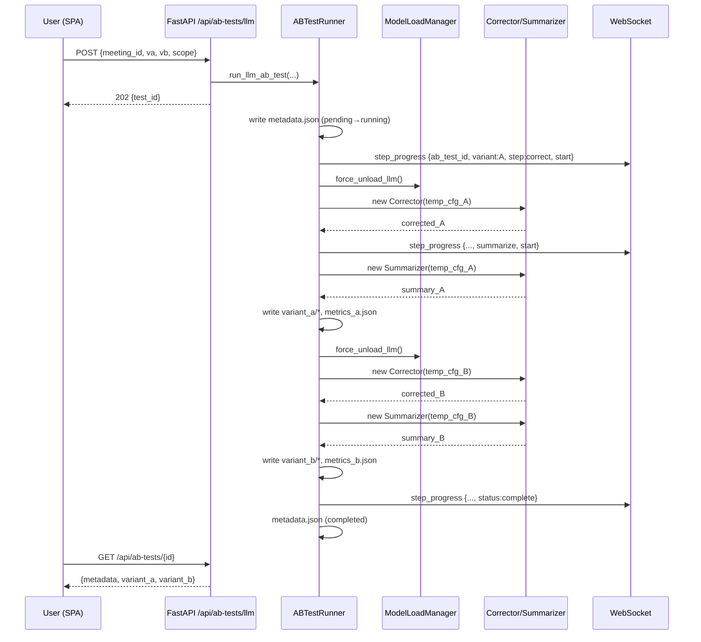

# LLM / STT 모델 A/B 테스트 기능 기술 설계서

- 작성일: 2026-04-09
- 작성자: Architect (Plan 에이전트)
- 상태: Draft
- 관련 이슈/작업: 기본 LLM 을 EXAONE 3.5 7.8B 로 복귀한 후속 작업

## 1. 개요 & 목표

### 1.1 배경
meeting-transcriber 는 macOS Apple Silicon 에서 로컬로 동작하는 한국어 회의 전사·요약 파이프라인이다. 현재 LLM 이 EXAONE 3.5 7.8B 로 복귀되었으나, 사용자는 여러 후보 모델(Gemma 4 E2B/E4B, Unsloth UD 4bit, 향후 Qwen 등)과 STT 모델(seastar-medium-4bit, ghost613-turbo-4bit, komixv2)을 자신의 실제 회의 데이터로 직접 비교하고 싶어한다. 현재는 `config.yaml` 수동 수정 + 전체 재요약을 반복해야 하므로 실용성이 떨어진다.

### 1.2 해결하는 문제
- 모델 후보 비교를 위한 반복적인 수동 설정 변경 제거
- 동일한 입력에 대해 **보정/요약** 또는 **전사** 결과의 1:1 비교 UX 제공
- 비교 결과가 **본 파이프라인 출력물과 완전히 격리** 되어 원본 회의가 오염되지 않음
- 16GB 환경에서 두 모델 동시 로드 없이 안전하게 순차 실행

### 1.3 성공 기준
사용자가 다음 플로우를 완주할 수 있으면 "완료":
1. 기존 회의 하나를 선택하고 "A/B 테스트 시작" 을 누른다.
2. LLM 2개 또는 STT 2개를 선택하고 실행한다.
3. 두 모델이 **순차** 로 실행되며, 진행률이 실시간으로 표시된다.
4. 완료 후 좌우 비교 뷰에서 교정 결과/요약/전사 차이와 메트릭(처리시간, 글자수, 금지 패턴 수)을 확인한다.
5. 원본 회의의 `outputs/{meeting_id}/` 는 전혀 변경되지 않았음을 확인한다.
6. 테스트 결과를 삭제하면 디스크에서 완전히 사라진다.

### 1.4 범위 밖 (Non-goals)
- 3개 이상 모델 동시 비교(A/B/C…). 이번에는 2-way 만 지원.
- 자동 회귀 벤치마크 대시보드, 시계열 품질 추적
- 비교 결과의 커뮤니티 공유/리포트 업로드
- 모델 자동 다운로드/카탈로그 서비스 통합
- 원본 회의 덮어쓰기 / "A 채택" 버튼으로 본 결과 교체 (향후)

## 2. 아키텍처 결정 사항 (ADR)

### ADR-1: 저장 방식 — **파일 기반 JSON 저장소**
- 대안: (a) SQLite `ab_tests` 테이블 신설, (b) `~/.meeting-transcriber/ab_tests/{id}/` 파일 트리
- 선택: (b)
- 이유: 기존 회의 파일 레이아웃(`outputs/{meeting_id}/`)과 동일한 멘탈 모델, SQLite 스키마 마이그레이션 불필요, 기존 `transcribe.json` / `correct.json` / `summary.md` 포맷을 그대로 재사용 가능하여 기존 뷰어 컴포넌트 재활용 용이. 목록 조회 성능은 테스트 수가 수백 개 이하이므로 디렉터리 스캔으로 충분.

### ADR-2: 테스트 ID — **`ab_{YYYYMMDD-HHMMSS}_{shortuuid8}`**
- 대안: (a) UUID4, (b) 타임스탬프, (c) 하이브리드
- 선택: (c). 시간순 정렬/디버깅 용이 + 충돌 방지.
- path traversal 방지: 정규식 `^ab_\d{8}-\d{6}_[a-f0-9]{8}$` 화이트리스트 검증.

### ADR-3: 모델 선택 UX — **하이브리드 (드롭다운 + 자유 입력)**
- 대안: (a) 드롭다운만, (b) HF repo ID 자유 입력만, (c) 하이브리드
- 선택: (c)
- LLM: 드롭다운은 "권장 프리셋"(EXAONE 3.5 7.8B 4bit, Gemma 4 E2B it 4bit, Gemma 4 E4B it 4bit, Unsloth UD 변종 등)을 하드코딩 + 자유 입력 필드로 HF repo ID 직접 지정 가능.
- STT: `core/stt_model_registry.py` 에 등록된 ID 만 드롭다운 제공 (자유 입력 금지 — 다운로드/검증 흐름 복잡).
- 이유: 초보자는 드롭다운, 고급 사용자는 자유 입력. STT 는 모델 포맷/레지스트리 제약으로 자유 입력 위험.

### ADR-4: 결과 저장 위치 — **`~/.meeting-transcriber/ab_tests/{test_id}/`**
```
ab_tests/
  ab_20260409-143000_a1b2c3d4/
    metadata.json
    variant_a/
      transcribe.json      # STT 테스트 시
      correct.json         # LLM 테스트 시
      summary.md           # LLM 테스트 시
      metrics.json
      stderr.log           # 실패 디버깅용 tail
    variant_b/
      ...
```
- `paths.resolved_base_dir` 하위에 고정. 본 파이프라인 `outputs/` 와 완전 분리.

### ADR-5: 진행률 이벤트 — **기존 `step_progress` 재활용 + payload 확장**
- 대안: (a) 새 `ab_test_progress` 이벤트, (b) 기존 `step_progress` 에 `ab_test_id` / `variant` 필드 추가
- 선택: (b)
- 이유: 프론트엔드 WebSocket 핸들러가 이미 존재하고 단계명 렌더링 로직이 재사용 가능. payload 에 `ab_test_id?: str`, `variant?: "A"|"B"` 옵셔널 필드를 추가하면 기존 회의 진행률과 충돌 없이 라우팅 가능. 프론트엔드는 `ab_test_id` 존재 여부로 A/B 결과 뷰에만 표시.

### ADR-6: 기존 파이프라인과의 격리 — **별도 러너 클래스 `ABTestRunner`**
- 대안: (a) `PipelineManager` 확장, (b) 별도 러너
- 선택: (b)
- 이유: 본 파이프라인은 DB 상태/체크포인트/SSE/알림/임베딩/검색 인덱싱 등 부수효과가 많다. 러너에서 필요한 step 함수만 직접 호출하면 부수효과 없이 격리 실행 가능. 기존 파이프라인 코드 수정 최소화 원칙 준수.

### ADR-7: 큐 통합 — **독립 처리 (job_queue 미편입)**
- 대안: (a) `job_queue.py` 에 `ab_test` job 타입 추가, (b) 독립 asyncio Task
- 선택: (b)
- 이유: A/B 테스트는 사용자가 명시적으로 트리거하는 실험이며 녹음 감시/처리 파이프라인과 성격이 다르다. 다만 `ModelLoadManager` 뮤텍스는 공유하므로 본 파이프라인 진행 중에는 자연스럽게 대기한다 (동시 실행 시 교착 회피).
- **동시성 제약**: 프로세스 내 `_ab_test_lock = asyncio.Lock()` 을 둬서 A/B 테스트는 한 번에 1개만. 두 번째 요청은 `409 Conflict`.

### ADR-8: STT A/B 에서 diarize 재사용 전략
- 원본 회의의 `outputs/{meeting_id}/diarize.json` 체크포인트를 **읽기 전용** 으로 복사/참조한다.
- 플로우: `transcribe_A → merge(with cached diarize) → transcribe_B → merge(with cached diarize)`.
- 폴백: diarize 체크포인트가 없으면 (오래된 회의) → 사용자에게 경고 표시하고 "diarize 재실행 허용" 토글을 제공(기본 OFF). ON 이면 1회 diarize 수행 후 두 STT 에 공유.

### ADR-9: 모델 교체 메커니즘 — **`model_copy(update=...)` 로 임시 config 생성**
- `config.py` 의 `LLMConfig`, `STTConfig` 는 pydantic `BaseModel` 이며 frozen 아님 → `model_copy(update={"mlx_model_name": "..."})` 안전.
- `AppConfig.model_copy(update={"llm": new_llm})` 로 전체 config 복제.
- 새 `Corrector(temp_config, shared_manager)` / `Summarizer(...)` / `Transcriber(...)` 인스턴스를 생성하면 생성자에서 새 모델명을 읽는다.
- `MLXBackend` 는 생성자에서 `config.mlx_model_name` 을 읽어 로드하므로, variant 간 전환 시 **기존 MLXBackend 인스턴스를 명시적으로 해제(`del`, `gc.collect()`)** 후 새 인스턴스 생성. `ModelLoadManager` 의 언로드 훅을 사용.

## 3. 데이터 모델

### 3.1 디렉터리 레이아웃
`~/.meeting-transcriber/ab_tests/{test_id}/` (ADR-4 참조)

### 3.2 `metadata.json` 스키마
```json
{
  "test_id": "ab_20260409-143000_a1b2c3d4",
  "test_type": "llm" | "stt",
  "source_meeting_id": "meeting_20260408-...",
  "source_snapshot": {
    "merge_json_path": "<절대경로>",
    "wav_path": "<절대경로>",
    "diarize_json_path": "<경로 or null>"
  },
  "scope": {
    "correct": true,
    "summarize": true
  },
  "variant_a": {
    "label": "EXAONE 3.5 7.8B 4bit",
    "model_id": "mlx-community/EXAONE-3.5-7.8B-Instruct-4bit",
    "backend": "mlx"
  },
  "variant_b": { "...": "..." },
  "status": "pending|running|completed|failed|cancelled",
  "current_variant": "A|B|null",
  "current_step": "transcribe|correct|summarize|null",
  "progress_pct": 0,
  "started_at": "2026-04-09T14:30:00+09:00",
  "completed_at": null,
  "error": null,
  "schema_version": 1
}
```

### 3.3 `variant_{a|b}/metrics.json`
```json
{
  "elapsed_seconds": { "transcribe": 42.1, "correct": 18.3, "summarize": 12.7, "total": 73.1 },
  "char_count": { "correct": 12843, "summary": 2104 },
  "utterance_count": 186,
  "avg_utterance_len": 69.0,
  "forbidden_patterns": {
    "speaker_placeholder": 0,
    "unknown_label": 0,
    "english_gloss": 3,
    "total": 3
  },
  "peak_memory_mb": 6821
}
```

### 3.4 결과 파일 포맷
기존 `steps/transcriber.TranscriptResult.to_checkpoint()` / `CorrectedResult` / `SummaryResult` 의 JSON/마크다운 포맷을 그대로 사용. 이렇게 하면 프론트엔드의 기존 렌더러(교정 발화 리스트, 요약 마크다운) 컴포넌트를 재활용 가능.

## 4. 백엔드 설계

### 4.1 신규 모듈 `core/ab_test_runner.py`

#### 주요 공개 함수 시그니처
```python
async def run_llm_ab_test(
    source_meeting_id: str,
    variant_a: ModelSpec,
    variant_b: ModelSpec,
    scope: LlmScope,  # {"correct": bool, "summarize": bool}
) -> str:  # test_id

async def run_stt_ab_test(
    source_meeting_id: str,
    variant_a: SttModelSpec,
    variant_b: SttModelSpec,
    allow_diarize_rerun: bool = False,
) -> str:

def get_test_status(test_id: str) -> dict
def get_test_result(test_id: str) -> dict
def list_tests(source_meeting_id: str | None = None) -> list[dict]
def delete_test(test_id: str) -> None
async def cancel_test(test_id: str) -> None
```

`ModelSpec` 는 dataclass: `{label: str, model_id: str, backend: "mlx"|"ollama"}`.

#### 내부 의사코드 — LLM A/B
```
async def run_llm_ab_test(meeting_id, va, vb, scope):
    async with _ab_test_lock:  # 동시 1개
        validate_meeting_exists(meeting_id)
        validate_models_different(va, vb)
        merge_path = resolve(meeting_id)/"merge.json"
        assert merge_path.exists()

        test_id = new_test_id()
        root = ensure_ab_test_dir(test_id)
        write_metadata(root, ...)

        try:
            for variant, spec in [("A", va), ("B", vb)]:
                update_status(test_id, running, current_variant=variant)
                temp_cfg = app_config.model_copy(update={
                    "llm": app_config.llm.model_copy(update={
                        "mlx_model_name": spec.model_id,
                        "backend": spec.backend,
                    })
                })
                merged = MergedResult.from_checkpoint(merge_path)

                await model_manager.force_unload_llm()

                if scope.correct:
                    emit_step_progress(test_id, variant, "correct", "start")
                    corrector = Corrector(temp_cfg, model_manager)
                    corrected = await corrector.correct(merged)
                    corrected.save_checkpoint(root/variant_dir/"correct.json")
                    emit_step_progress(test_id, variant, "correct", "complete")
                if scope.summarize:
                    emit_step_progress(test_id, variant, "summarize", "start")
                    summarizer = Summarizer(temp_cfg, model_manager)
                    summary = await summarizer.summarize(corrected)
                    write(root/variant_dir/"summary.md", summary.markdown)
                    emit_step_progress(test_id, variant, "summarize", "complete")

                compute_and_write_metrics(root/variant_dir, corrected, summary, elapsed)
                await model_manager.force_unload_llm()

            update_status(test_id, completed)
            return test_id
        except Exception as e:
            update_status(test_id, failed, error=str(e))
            raise
```

#### 내부 의사코드 — STT A/B
```
async def run_stt_ab_test(meeting_id, va, vb, allow_diarize_rerun):
    wav = resolve(meeting_id)/"input.wav"
    diarize_ckpt = resolve(meeting_id)/"diarize.json"
    if not diarize_ckpt.exists():
        if not allow_diarize_rerun: raise UserError("diarize 체크포인트 없음")
        cached_diarize = await Diarizer(cfg).diarize(wav)
    else:
        cached_diarize = DiarizeResult.from_checkpoint(diarize_ckpt)

    for variant, spec in [("A",va),("B",vb)]:
        temp_cfg = cfg.model_copy(update={"stt": cfg.stt.model_copy(update={"model_name": spec.model_id})})
        await model_manager.force_unload_stt()
        transcriber = Transcriber(temp_cfg, model_manager)
        transcript = await transcriber.transcribe(wav)
        merged = Merger(temp_cfg).merge(transcript, cached_diarize)
        transcript.save_checkpoint(variant_dir/"transcribe.json")
        merged.save_checkpoint(variant_dir/"merge.json")
        compute_and_write_metrics(...)
        await model_manager.force_unload_stt()
```

### 4.2 API 엔드포인트 (api/routes.py 에 추가)

| Method | Path | Body | Response |
|---|---|---|---|
| POST | `/api/ab-tests/llm` | `{source_meeting_id, variant_a, variant_b, scope}` | `202 {test_id}` |
| POST | `/api/ab-tests/stt` | `{source_meeting_id, variant_a, variant_b, allow_diarize_rerun}` | `202 {test_id}` |
| GET | `/api/ab-tests` | `?source_meeting_id=...` | `200 {tests: [...]}` |
| GET | `/api/ab-tests/{test_id}` | - | `200 {metadata, variant_a, variant_b}` |
| GET | `/api/ab-tests/{test_id}/variant/{a\|b}/summary` | - | `text/markdown` |
| DELETE | `/api/ab-tests/{test_id}` | - | `204` |
| POST | `/api/ab-tests/{test_id}/cancel` | - | `202` |

- POST 엔드포인트는 `asyncio.create_task(runner)` 로 비동기 실행 후 즉시 `202` 반환. 상태 추적은 WebSocket + polling 병행.
- path traversal 방지: `test_id` 정규식 검증 (ADR-2).
- 409 Conflict: 다른 A/B 테스트 진행 중일 때.

### 4.3 모델 교체 메커니즘 검증
- `config.py` 의 `LLMConfig`, `STTConfig`, `AppConfig` 는 모두 pydantic `BaseModel` (frozen=False 기본값) → `model_copy(update=...)` 안전.
- `Corrector.__init__(config, manager)`, `Summarizer.__init__` 동일하게 생성자에서 config 캐시 → 새 인스턴스 매번 생성 필요.
- `Transcriber.__init__` 에서 `self._model_name = self._config.stt.resolve_model_path()` 1회 읽음 → 새 인스턴스 생성으로 전환.
- `MLXClient.__init__(config)` 에서 `mlx_model_name` 읽어 모델 로드 → 인스턴스 파괴 시 MLX 메모리 해제. `ModelLoadManager` 에 `force_unload_llm()`, `force_unload_stt()` 추가(또는 기존 unload 호출).

### 4.4 WebSocket 이벤트 payload 확장 (ADR-5)
기존:
```json
{"type":"step_progress","meeting_id":"...","step":"correct","status":"start","progress":0.0}
```
확장:
```json
{"type":"step_progress","ab_test_id":"ab_...","variant":"A","step":"correct","status":"start","progress":0.0,"meeting_id":null}
```
`core/orchestrator.py` 의 브로드캐스트 함수는 dict 를 받아 그대로 전달 → 확장 필드가 호환된다. 기존 구독자는 `ab_test_id` 를 무시하면 된다.

## 5. 프론트엔드 설계

### 5.1 라우트 (`ui/web/spa.js`)
- `/app/ab-test` → `AbTestListView`
- `/app/ab-test/new?source=<meeting_id>&type=llm|stt` → `AbTestNewView`
- `/app/ab-test/:testId` → `AbTestResultView`

### 5.2 뷰 클래스
- `AbTestListView`: 전체 테스트 목록, 상태 배지, 생성 시각, 소스 회의 링크, 삭제 버튼.
- `AbTestNewView`:
  - 타입 선택 (LLM / STT)
  - 소스 회의 드롭다운 (최근 20개 + 검색)
  - Variant A/B 각각: 프리셋 드롭다운 + 자유 입력 필드 (LLM 한정)
  - LLM 범위 체크박스: 교정 / 요약
  - STT: "diarize 재실행 허용" 토글 (기본 OFF)
  - "시작" 버튼 → POST → 결과 뷰로 이동
- `AbTestResultView`:
  - 상단: 메타데이터 + 진행 상태 바 (running 시 WebSocket 구독)
  - 중앙: 좌우 2 컬럼 비교
    - LLM 테스트: 탭 1 "교정 결과" 발화 리스트 좌우 + diff, 탭 2 "요약" 마크다운 좌우
    - STT 테스트: 탭 1 "전사" 발화 timeline 좌우, 동일 시간 구간 가로 정렬
  - 우측 사이드: 메트릭 카드 (처리시간, 글자수, 금지 패턴, 단순 승자 배지)

### 5.3 진입 경로 (고급 기능으로 설정 페이지 내부 배치)
**사이드바에 별도 메뉴를 추가하지 않는다.** 일반 사용자에게 복잡도를 주지 않기 위해 **설정 페이지(`/app/settings`) 하단 "고급 기능" 섹션**에 `A/B 테스트` 링크를 배치한다. 또한 기존 회의 뷰어 상단 액션바에 "A/B 테스트 시작 ▾" 드롭다운 버튼을 추가해 해당 회의로 직접 진입 가능하게 한다 (발견성 보강).

**구현 메모**:
- `/app/settings` 하단에 `<section class="settings-advanced">` 추가
- 내부에 "A/B 테스트 목록 보기" / "새 테스트 만들기" 두 버튼
- 사이드바 네비게이션 항목(`nav-bar` 내 `nav-btn`)은 추가하지 않는다
- 라우트는 여전히 `/app/ab-test`, `/app/ab-test/new`, `/app/ab-test/:id` 로 유지(직접 URL 접근 가능)

### 5.4 비교 UI 상세
- **텍스트 diff**: `diff-match-patch` 같은 외부 라이브러리 대신 간단한 줄 단위 LCS 로 자체 구현(외부 의존성 0 유지).
- **금지 패턴 하이라이트**: 본문 렌더 시 정규식으로 `<mark class="warn">` 감싸기.
- **요약 마크다운**: 기존 회의 뷰어에서 쓰는 마크다운 렌더러 재사용.

### 5.5 WebSocket 연결
`AbTestResultView.mount()` 에서 기존 `/ws` 구독. `step_progress` 이벤트 중 `ab_test_id === this.testId` 만 필터링하여 진행률 바/단계 라벨 업데이트.

## 6. 메트릭 자동 스코어링

### 6.1 금지 패턴 정규식
```
SPEAKER_PLACEHOLDER  = r"SPEAKER_\d+"
UNKNOWN_LABEL        = r"\bUNKNOWN\b"
ENGLISH_GLOSS        = r"[가-힣]+\([A-Z][a-zA-Z]+\)"   # 한글(English) 병기
```

### 6.2 계산 대상
- `correct.json` 의 발화 텍스트 전체 concat 에 대해 count
- `summary.md` 본문에 대해 count
- 발화 수, 평균 발화 길이, 총 글자 수

### 6.3 단순 승자 알고리즘 (참고용)
```
score(variant) =
  - 2 * forbidden_total
  - 0.01 * elapsed_total_sec
  + 0.5 * log1p(char_count)
```
승자 표시는 "참고용" 라벨 명시 (최종 판단은 사용자). 동점은 "무승부".

### 6.4 처리시간 측정
각 step 호출 전후 `time.perf_counter()` wrap. `core/perf_stats.py` 와 독립 (A/B 는 perf_baseline 에 영향 X).

## 7. 테스트 전략

### 7.1 단위 테스트 (`tests/test_ab_test_runner.py`)
- `new_test_id()` 형식/충돌
- `test_id` path traversal 검증 (`../`, 절대 경로 등 거부)
- `metadata.json` 라운드트립
- 금지 패턴 카운터 (fixture 문자열)
- `model_copy(update=...)` 로 생성된 temp config 가 원본 오염 없는지
- `_ab_test_lock` 동시 실행 차단

### 7.2 통합 테스트 (`tests/test_ab_test_api.py`)
- POST /api/ab-tests/llm → 202 + test_id
- 두 번째 동시 POST → 409
- GET /api/ab-tests/{id} 상태 전이
- DELETE 후 디렉터리 삭제 확인
- 원본 `outputs/{meeting_id}/` 미변경 검증 (해시 비교)

### 7.3 Mocking 전략
`Corrector.correct` / `Summarizer.summarize` / `Transcriber.transcribe` 를 monkeypatch 로 빠른 stub 반환 → 실제 LLM 로드 없이 러너 로직 검증.

### 7.4 회귀 영향 분석
- `core/pipeline.py` 는 수정 없음 (ADR-6)
- `core/orchestrator.py` 의 `step_progress` payload 는 **필드 추가만** (기존 구독자 호환)
- `api/routes.py` 는 새 라우트만 추가
- `config.py` 는 수정 없음
- 결론: 기존 1900+ 테스트에 영향 없어야 함. CI 에서 전체 green 확인 필수.

## 8. 구현 순서 (커밋 단위)

1. **C1**: 본 설계서 커밋 (`docs/plans/2026-04-09-ab-test-feature.md`)
2. **C2**: 백엔드 러너 + 단위 테스트
   - `core/ab_test_runner.py` (모델 교체, 메트릭, 저장소)
   - `core/model_manager.py` 에 `force_unload_llm/stt` 보강(필요 시)
   - `tests/test_ab_test_runner.py`
3. **C3**: API 엔드포인트 + 통합 테스트
   - `api/routes.py` 에 `/api/ab-tests/*` 추가
   - `core/orchestrator.py` WebSocket payload 확장 (필드 추가만)
   - `tests/test_ab_test_api.py`
4. **C4**: 프론트엔드 기본 UI
   - `ui/web/spa.js` 에 `AbTestListView`, `AbTestNewView`, `AbTestResultView`(진행 상태 only), 라우트 등록
   - 사이드바 "Lab" 섹션 추가
5. **C5**: 프론트엔드 비교 뷰
   - 좌우 diff, 메트릭 카드, 마크다운 렌더, 금지 패턴 하이라이트
6. **C6**: 회의 뷰어 상단 "A/B 테스트 시작" 드롭다운, 사용성 개선
7. **C7**: 문서화 (CLAUDE.md, README, CHANGELOG)

의존성: C2 → C3 → C4 → C5 → C6. C7 은 C6 후.

## 9. 리스크 & 완화 방안

| 리스크 | 완화 |
|---|---|
| 두 모델 모두 큰 경우 메모리 압박 | A 실행 후 `force_unload_llm()` + `gc.collect()` + `mlx.core.metal.clear_cache()` (가능 시) 호출. B 로드 전 1초 대기. 메트릭에 peak_memory_mb 기록. |
| 본 파이프라인 큐와 충돌 | `ModelLoadManager` 뮤텍스로 자연 직렬화. UI 에 "본 파이프라인 처리 중" 배너 표시 후 대기. |
| 동시 A/B 테스트 | `_ab_test_lock` 으로 차단 + API 409. |
| `test_id` path traversal | 정규식 화이트리스트 + `Path.resolve()` 후 `ab_tests` 루트 하위인지 재확인. |
| 결과 파일 누적 | 수동 삭제 API 제공 + (선택) 30일 경과 자동 만료 cron (향후). 이번 범위에는 수동만. |
| STT A/B 에서 diarize 체크포인트 없음 | 기본 실패 + `allow_diarize_rerun=true` 옵트인 시 1회 실행 후 공유. |
| 같은 모델 쌍 선택 | API + UI 양쪽에서 검증. 같으면 400. |
| 모델 로드 실패 (HF repo 오타) | 러너에서 로드 예외를 잡아 해당 variant `failed` 처리, 반대 variant 는 정상 진행 허용. 최종 상태 `partial_failed`. |
| 실행 중 앱 종료 | `status=running` 으로 남은 테스트는 앱 시작 시 `failed`(`error="interrupted"`) 로 일괄 정리. |

## 10. 범위 밖 (Non-goals, 향후)
- 3-way 이상 비교
- 자동 회귀 벤치마크 대시보드
- 커뮤니티 결과 공유/익명 리포트
- 공개 모델 카탈로그/자동 다운로드 통합
- "A 채택 → 원본 회의에 적용" 버튼
- 사용자 정의 메트릭/가중치 편집 UI

## 부록 A: 시퀀스 다이어그램 — LLM A/B 실행 흐름


## 부록 B: 컴포넌트 관계도
```mermaid
graph LR
    SPA[SPA Views<br/>List/New/Result] -->|REST| Routes[api/routes.py<br/>/api/ab-tests/*]
    SPA <-->|WS step_progress| WS[api/websocket.py]
    Routes --> Runner[core/ab_test_runner.py]
    Runner --> Store[(ab_tests/{id}/<br/>file store)]
    Runner --> MM[core/model_manager.py]
    Runner --> Corr[steps/corrector.py]
    Runner --> Sum[steps/summarizer.py]
    Runner --> Trans[steps/transcriber.py]
    Runner --> WS
    Corr & Sum --> MLX[core/mlx_client.py]
    Trans --> MLXW[mlx-whisper]
    Runner -.reads.-> Outputs[(outputs/{meeting}/<br/>merge.json, diarize.json, input.wav)]
    Runner -.no write.-> Outputs
```
