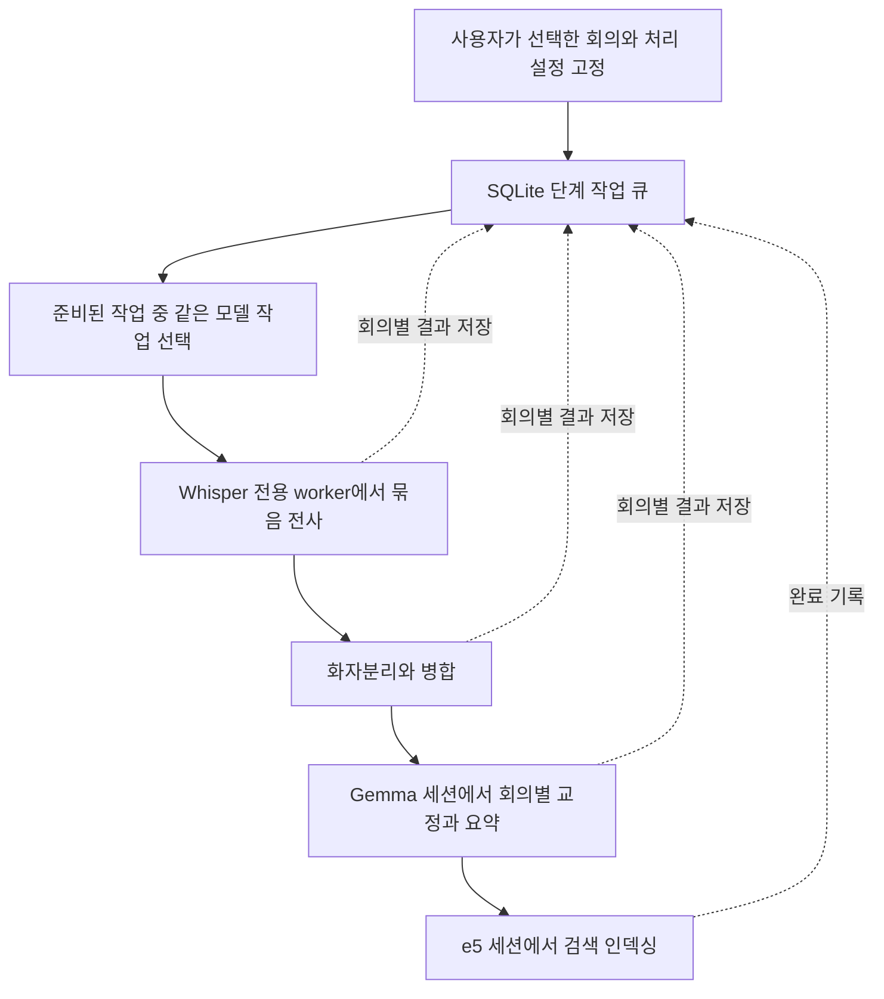

# 벌크 전사 효율 개선 제안

기준: 2026-09-15 KST, `20e4806` + 현재 로컬 Whisper 스레드 수정.
상태: 구조 분석 원안. 최초 조사에서는 앱 코드·의존성·사용자 데이터를 변경하지 않았다.
세 서브에이전트가 큐/복구, 성능 근거, 모델 수명주기를 나누어 읽고, 잠금·캐시 경계는 독립적으로 교차 확인했다.

### 후속 구현

사용자 승인 후 비동기 모델 lifecycle, 유한 모델 재사용 scope, 생성 통계, raw LM cache
격리와 최대 2건의 단계별 JobProcessor 경로를 구현했다. 새 StageWorkQueue는 현재 실행
기록으로 연결했고, 재시작 복구는 기존 JobQueue·체크포인트를 계속 사용한다. 기존의
메모리 기반 지연 LLM background task 전체를 새 큐로 전환한 것은 아니다.

일괄 기능은 `bulk_stage_batching: false`로 기본 비활성이다. 프로젝트 의존성도 유지한다.
VLM 0.7.1은 별도 환경에서 비교했고, 실제 토큰 병렬 배치·pyannote worker 상주·동적
서멀 정책은 아래 제안의 후속 실험이다. 구현 계약은
[단계별 일괄 처리](../design-decisions/bulk-stage-processing.md), 검증 결과는
[프로젝트 상태](../STATUS.md)를 참고한다.

## 1. 결론

**목표 구조는 단계별 영속 큐 + 같은 모델을 유지하는 실행 세션 + 크기가 제한된 벌크 묶음이다.**
사용자가 선택한 회의들을 Whisper, 화자분리, Gemma, 검색 인덱싱 순서로 모아 처리하되,
각 회의의 결과는 단계마다 저장한다. 단건은 첫 회의록을 빨리 주고, 벌크는 전체 처리량을 우선한다.

단, 구조 변경만으로 몇 배 빨라진다고 말할 근거는 없다. 현재 측정은 모델 로딩보다
화자분리와 LLM 계산을 중요한 개선 대상으로 가리킨다. **기존 실행의 정확한 계측,
현재 Gemma 입력 처리 최적화 비교, 모델 세션, 영속 스케줄러 순으로 검증 비용을 늘리는 것**을 권한다.
이미 구현한 교정→요약 모델 재사용, changed-only 출력, Gemma prompt cache를 신규 절감으로 중복 계산하면 안 된다.

## 2. 근거와 측정 한계

### 현재 장비의 실제 모델 실행 로그

현재 조사 장비는 Apple M4 / 24GiB다. 목표 환경인 16GB MacBook Air 전체를 대표하지 않는다.
직전 작업의 47초 한국어 합성 WAV 하나를 두 번 처리한 로그를 이번에 다시 분석했다.
화자분리·요약·임베딩을 포함한 전체 파이프라인 테스트가 아니다.

| 항목 | 첫 실행 | 두 번째 실행 |
|---|---:|---:|
| Whisper 전사 단계 | 43.524초 | 53.475초 |
| Gemma 교정 단계 | 111.664초 | 50.915초 |
| 위 교정 단계에 포함된 매니저의 모델 로드 구간 | 10.435초 | 7.264초 |
| 로드 완료 이후 교정 완료까지 | 101.229초 | 43.648초 |

두 번의 전사+교정 약 259.6초 중 기록된 Gemma 로드 구간은 17.7초, 약 6.8%다.
이는 **재사용 시 절감률 또는 총 절감의 상한이 아니다**. 최초 로드는 여전히 필요하고,
Whisper 가중치 로딩은 모듈 로드 로그 이후 추론 함수 안에서 일어난다. 첫 토큰 전 준비와
실제 계산도 별도로 측정하지 않았다. 같은 입력에서도 편차가 크므로 두 번의 평균을 일반화하지 않는다.

근거: [실제 로그](/private/tmp/whisper-gemma-thread-verification-20260915.log),
[검증 스크립트](/Users/youngouksong/projects/meeting-transcriber/scripts/verify_whisper_gemma_threads.py).

### 과거 성능 자료를 다시 읽은 결과

- `183.6초` 결과는 convert 0.037 + STT 31.248 + correct 104.683 + summarize 47.641초다.
  화자분리는 single-speaker stub으로 0초이며 chunk/embed는 빠져 있다.
- 비교 대상으로 적힌 `271.8초`도 STT가 캐시 복원 0.002초이고 화자분리는 생략됐다.
  두 숫자를 전체 파이프라인 개선율로 비교하지 않는다.
- 별도 527.1초 음성 한 개의 과거 화자분리 실측은 community-1 exclusive 433.8초,
  regular 460.8초였다. 긴 무음 압축 조합은 오히려 578.6–694.6초로 느렸다.
  이 표본에서는 화자분리가 크지만, 서로 다른 실행의 시간을 합쳐 현재 단계별 비중을 만들 수 없다.
- 기존 성능 보고서의 UI 응답시간은 추정과 오래된 코드 위치가 포함돼 있다.
- 현재 2건마다 180초 쉬는 정책에서 긴 연속 큐의 평균 명시적 대기는 약 90초/건이다.
  `90/(실제 계산 시간+90)`은 휴식을 전부 없앴을 때의 산술적 비중일 뿐,
  발열로 인한 속도 저하와 안정성 비용을 무시하므로 제품 개선율로 쓰지 않는다.

근거: [벤치마크 JSON](/Users/youngouksong/projects/meeting-transcriber/benchmark_runs/20260622_llm_changed_only_guarded_fallback_v2/ai_pipeline_benchmark.json:49),
[화자분리 실측](/Users/youngouksong/projects/meeting-transcriber/docs/BENCHMARK.md:200),
[고정 쿨다운](/Users/youngouksong/projects/meeting-transcriber/core/thermal_manager.py:276).

## 3. 현재 구조의 실제 경계

| 영역 | 현재 동작 | 효율 개선에 주는 의미 |
|---|---|---|
| 실행 단위 | JobProcessor가 회의 전체 `pipeline.run()`을 실행 | 회의 중간에 다른 회의의 같은 단계로 넘어가는 기능이 없음 |
| 전사 큐 | SQLite에 실행 의도·선택 모델·접수 내역 저장 | 단계 큐로 확장할 기반은 있음 |
| 별도 교정·요약 | 프로세스 안의 `asyncio.create_task()`로 순차 실행 | 재시작 시 자동 이어가기 전에 영속 등록 필요 |
| Whisper | 현재 로컬 수정은 전용 스레드 + 회의 종료 시 캐시 정리 | 벌크에서만 동일 세션 유지 정책을 추가할 수 있음 |
| 화자분리 | Zoom pause 경로는 회의마다 자식 프로세스 시작·모델 로드·종료 | 부모의 keep_loaded만 바꿔서는 pyannote가 재사용되지 않음 |
| Gemma | 같은 회의의 correct→summary는 이미 재사용 | 추가 이익은 회의와 회의 사이에서 발생 |
| 지연 LLM | `run_llm_steps()`가 finally에서 모델 정리 | 호출 순서를 모아도 매번 로딩됨 |
| 검색 | 후처리에 임베딩까지 포함 | Gemma 작업 중간에 e5로 교체되지 않도록 마지막으로 분리 필요 |
| 로딩/정리 | 동기 loader와 executor `.result()`를 이벤트 루프에서 기다림 | 추론은 비동기여도 로딩 동안 화면/API 응답이 늦어질 수 있음 |
| 메모리 제한 | 9.5GB는 부모 프로세스 RSS 경고 | 자식 프로세스·Metal·KV cache를 합친 강제 상한이 아님 |
| 온도 감지 | 현재 온도 판독은 None, 고정 대기 사용 | 온도 기반 동적 최적화가 이미 구현됐다고 보면 안 됨 |

근거:
[회의 실행](/Users/youngouksong/projects/meeting-transcriber/core/orchestrator.py:571),
[일괄 후처리 task](/Users/youngouksong/projects/meeting-transcriber/api/routers/meetings_batch.py:1175),
[교정 재사용](/Users/youngouksong/projects/meeting-transcriber/steps/corrector.py:829),
[요약 해제 경계](/Users/youngouksong/projects/meeting-transcriber/steps/summarizer.py:556),
[지연 LLM 정리](/Users/youngouksong/projects/meeting-transcriber/core/pipeline.py:3434),
[화자분리 subprocess](/Users/youngouksong/projects/meeting-transcriber/steps/diarizer.py:604),
[모델 로드](/Users/youngouksong/projects/meeting-transcriber/core/model_manager.py:391),
[RSS 경고](/Users/youngouksong/projects/meeting-transcriber/core/model_manager.py:327).

추가 확인: `skip_llm_steps`를 켜면 correct뿐 아니라 summary/chunk/embed도 건너뛰고
해당 단계를 completed 목록에 넣는다. 현재는 교정 전 임베딩을 항상 한 번 더 수행하는 구조가 아니다.
기존 인덱스가 있는 경우의 재색인과 새 전사만 작업을 구분해야 한다.
근거: [의존 단계 스킵](/Users/youngouksong/projects/meeting-transcriber/core/pipeline.py:2849).

## 4. 최신 시스템 기능 중 실제로 검토할 것

### 4.1 MLX: 실행 스레드와 모델 상태 소유자를 고정

MLX 0.32.2 공식 API는 Stream과 ThreadLocalStream을 구분한다.
이 앱에서는 모델·지연 연산·KV cache의 소유자를 하나의 worker로 고정하는 설계를 유지한다.
일반 Python 스레드를 여러 개 만드는 것을 GPU 효율 향상과 동일시하지 않는다.
[공식 Stream API](https://ml-explore.github.io/mlx/build/html/python/devices_and_streams.html),
[MLX 메모리 계측 API](https://github.com/ml-explore/mlx/blob/main/docs/src/python/memory_management.rst).

### 4.2 mlx-vlm 0.7.1: Gemma 입력 처리 최적화가 실제로 추가됨

공식 최신 릴리스는 2026-09-14 UTC의 **0.7.1**, 현재 설치는 **0.6.17**이다.
0.7.1에는 Gemma 4가 이미 만든 KV를 읽는 후반 계층에서 불필요한 입력 위치의 계산을
생략하는 변경이 포함된다. 모델 로드 횟수보다 실제 LLM 계산을 줄이는 후보라 우선 A/B할 가치가 있다.

공식 PR은 **E2B / M5 Max / 1,011토큰 입력 처리만** 0.102→0.040초, 2.55배를 보고한다.
이를 우리 **E4B / M4 / 전체 회의 처리**의 2.55배로 옮길 수 없다. 0.6.17→0.7.1 전체 버전 차이에는
다른 변경도 있으므로, 동일 checkpoint·프롬프트·입력으로 전체 출력과 속도를 다시 비교해야 한다.
[공식 릴리스](https://github.com/Blaizzy/mlx-vlm/releases/tag/v0.7.1),
[Gemma prefill 최적화 PR](https://github.com/Blaizzy/mlx-vlm/pull/2157).

같은 릴리스에는 공통 prefix 재사용과 cache 메모리 제한 개선도 있다. 다만 긴 문서·다른 모델·서버
실측이며, 앱은 현재 `PromptCacheState`를 직접 사용한다. 패키지 업데이트만으로 서버의 APC 기능이
우리 호출 경로에도 적용됐다고 간주하지 않는다. 자동 disk cache를 도입하면 로컬 데이터 보존 범위도
달라지므로, 첫 실험은 제한된 메모리 cache로 한다.
[APC 변경과 검증 범위](https://github.com/Blaizzy/mlx-vlm/pull/2182).

### 4.3 모델 유지, 작업 순서, GPU 배치는 다른 최적화

| 방법 | 뜻 | 이번 권고 |
|---|---|---|
| 단계 묶기 | 여러 회의의 같은 단계를 연속 배치 | 영속 큐와 함께 도입 |
| 모델 유지 | 다음 작업도 같은 모델 인스턴스 사용 | 먼저 작은 변경으로 검증 |
| 발화 묶기 | 여러 발화를 한 프롬프트에 넣음 | 이미 있음. 발화 수보다 토큰 길이로 보완 |
| 실제 추론 배치 | 독립 요청 여러 개를 한 모델의 배치 연산으로 계산 | Gemma에서 1/2/4 요청 비교 후 채택 |

설치된 mlx-vlm 0.6.17에도 `batch_generate(..., prompts=..., images=None)` 경로가 있다.
현재 앱의 순차 `stream_generate` 루프와는 다르다. `asyncio.gather(chat...)`로 바꾸는 것은
진짜 배치가 아니며 같은 가변 cache를 동시에 사용하게 해서는 안 된다.
각 요청의 회의 ID·발화 ID·cache를 분리하고 길이가 비슷한 요청끼리 묶는다.
메모리와 지연을 측정해 1/2/4 중 선택하며, 전사문들을 하나의 거대한 대화로 합치지 않는다.
[MLX-VLM 배치 구현](https://github.com/Blaizzy/mlx-vlm/blob/main/mlx_vlm/generate/ar.py),
[MLX-LM 공식 배치 예제 안내](https://github.com/ml-explore/mlx-lm).

### 4.4 텍스트 전용 Gemma 실행은 별도 실험 후보

설치된 mlx-lm 0.31.3에도 Gemma 4 구현이 있고 vision/audio 가중치를 제외하는 sanitize 경로가 있다.
현재 앱은 모델명에 gemma-4가 있으면 VLM으로 고정한다. 텍스트만 필요한 교정·요약에는
동일 Gemma의 LM 경로가 메모리를 줄이는지 비교할 수 있다. 단, 현 checkpoint의 정확한 로딩,
projection 양자화, tokenizer/template, 출력 동등성은 미검증이다. 기본 경로를 바로 바꾸지 않는다.
[공식 Gemma 4 LM 구현](https://github.com/ml-explore/mlx-lm/blob/main/mlx_lm/models/gemma4.py).

### 4.5 영속 실행의 원칙을 로컬 SQLite에 적용

최신 워크플로 시스템의 유용한 원칙은 작업 의도 저장, 재시도 가능한 단계, 중복 게시 방지다.
이 앱은 한 Mac의 단일 모델 실행기이므로 우선 기존 SQLite에 적용하는 편이 적합하다.
Temporal/Ray/Redis 서버를 추가할 근거는 현재 없다. SQLite는 짧은 상태 변경 transaction에 쓰고
모델 계산 동안 transaction을 열어두지 않는다. WAL에도 writer는 한 번에 하나다.
[Temporal의 재실행·멱등성 계약](https://github.com/temporalio/documentation/blob/main/docs/encyclopedia/activities/local-activity.mdx),
[SQLite WAL 공식 설명](https://www.sqlite.org/wal.html).

## 5. 권장 목표 구조

### 순서는 묶되 전체 backlog를 무기한 기다리지 않는다

- 단건 모드: 현재처럼 한 회의를 끝까지 진행해 첫 회의록을 빨리 제공.
- 벌크 모드: 접수 시 대상 목록을 고정하고 건수·누적 음성 길이·최대 대기시간으로 묶음을 제한.
- 야간 처리: 사용자가 선택한 유한 묶음 전체를 같은 단계로 처리하는 정책도 비교 가능.
- 낮 시간: 작은 묶음마다 완성된 회의록을 만들고 긴 회의가 나머지 결과를 계속 막지 않게 조정.
- 실패한 회의는 해당 단계에서 남겨두고, 완료된 회의들은 다음 단계로 진행.
- 새로 들어온 녹음을 현재 묶음에 끝없이 추가하지 않는다. 사용자 긴급 요청은 안전한 단계 경계에서 우선.

처음부터 학습형 스케줄러는 필요 없다. 고정 2/4/8개 묶음과 오디오 길이 제한을 실험값으로 비교하고,
단계별 실제 시간 자료가 쌓이면 기존 ETA를 보정해 다음 묶음의 예상 비용을 계산한다.

### 모델 유지 세션

- 한 번에 하나의 큰 모델이라는 기존 계약을 유지한다.
- 같은 모델·버전·옵션인 작업 사이에서는 가중치를 유지하되, 요청별 KV/cache는 별도 범위로 관리한다.
- 현재 매니저의 이름 문자열만으로는 장기 재사용 키가 부족하다. 실제 모델 revision·백엔드·양자화·
  디바이스·설정 revision을 포함한다. e5는 입력 청크 수에 따라 CPU/MPS가 달라질 수 있다.
- 유휴·메모리 압박·Zoom·취소·다른 모델 요청·세션 종료 시 실제 추론이 끝난 뒤 해제한다.
- `keep_loaded=True`를 전체 코드에 무조건 붙이는 방식은 피한다. 종료 책임은 한 소유자에게 둔다.
- 화자분리 warm worker는 현재 subprocess 격리를 보존한 채 여러 요청을 받는 별도 설계가 필요하다.
  Zoom pause는 같은 worker에서 정지·재개하고 정지 시간을 실행 예산에서 제외한다.
  실패·timeout·취소 뒤에는 실제 종료를 확인한 후 worker를 폐기/재시작한다.
  화자 라벨·요청 상태는 회의별로 초기화한다.

## 6. 구현 전에 반드시 풀어야 할 계약

1. **단계 작업과 상태**: 회의 ID, generation, 단계, 의존 산출물, 모델/옵션 snapshot,
   ready/running/succeeded/failed/cancel_requested, attempt/claim token을 영속 저장한다.
   기존 batch receipt는 이력이며 실행 큐와 구분한다.
2. **양보와 생략을 구분**: 단계 묶음 사이 대기를 `skip_llm_steps`로 표현하지 않는다.
   현재 재개는 max(completed)+1이므로 waiting을 완료로 기록하면 미완료 단계를 놓친다.
3. **잠금 순서 유지**: meeting lease → LLM lock → model context. 외부에서 model context를 잡고
   다음 회의 lease를 기다리면 기존 수동 요약과 교착될 수 있다. 같은 acquire의 중첩도 금지한다.
   세션은 유지 정책을 소유하고, 개별 추론의 잠금은 기존 순서대로 잡거나 backend를 명시 주입한다.
4. **원본·결과 일관성**: 단계마다 lease를 반납할 때는 source revision과 의존 산출물 identity를
   실행 시작 및 게시 직전에 검사한다. 편집·재전사 후 이전 결과가 게시되지 않게 한다.
5. **파일과 DB의 완료 처리**: 계산은 장애 후 다시 실행될 수 있다. generation에 결합된 안전한
   산출물 게시와 DB 완료 기록을 대조해 중복 게시를 막는다. 임의의 부분 파일은 재개 근거로 신뢰하지 않는다.
6. **실제 종료 확인**: timeout 응답은 native 종료가 아니다. 기존 deferred cleanup이 끝나기 전에
   새 모델을 로딩하거나 claim 만료만으로 같은 단계의 두 번째 실행을 시작하지 않는다.
   비동기 로드도 동일한 lease를 가져야 한다. 현재 lease는 로드 완료 후 등록되므로 단순히
   `to_thread(loader)`로 옮기면 로드 중 취소 시 잠금이 먼저 풀릴 수 있다.
7. **동의 유지**: 로컬 최적화가 OpenAI 자동 전환이나 외부 업로드를 유발해서는 안 된다.

근거: [재개 계산](/Users/youngouksong/projects/meeting-transcriber/core/pipeline.py:1444),
[잠금 순서](/Users/youngouksong/projects/meeting-transcriber/core/pipeline.py:3421),
[비재진입 모델 context](/Users/youngouksong/projects/meeting-transcriber/core/model_manager.py:802),
[native 종료 대기](/Users/youngouksong/projects/meeting-transcriber/core/model_manager.py:873).

## 7. 권장 실행 순서

| 순서 | 작업 | 채택 판단 |
|---|---|---|
| 1 | 로딩/대기/전처리/prefill/decode/출력 저장/쿨다운 계측 | 각 비용을 분리하고 전체 실행시간과 합계가 맞는지 확인 |
| 2 | 별도 환경에서 VLM 0.6.17 vs 0.7.1, 동일 Gemma E4B A/B | 속도·메모리·고유명사·숫자·누락·형식 오류가 함께 허용 범위인지 |
| 3 | 모델 수명주기를 안전한 비동기 실행으로 만들고 세션 유지 도입 | UI 응답과 취소 안전성 유지, 실제 모델 load count 감소 |
| 4 | 별도 교정/요약 접수부터 SQLite 영속 단계 큐로 통합 | 재시작 후 누락·중복 게시 없이 이어가기 |
| 5 | Whisper/Gemma/e5를 제한된 묶음으로 실행 | 첫 전사·첫 요약 지연과 전체 완료시간을 함께 비교 |
| 6 | Gemma 독립 요청 배치 1/2/4, 입력 토큰 예산 조정 | 처리량 증가가 메모리·출력 품질 저하보다 큰 경우 채택 |
| 7 | 화자분리 warm subprocess 및 CPU 스레드 수 조정 | 로딩 vs 추론 분리 실측, Zoom pause·timeout·worker 교체 테스트 |
| 8 | 작업 시간·메모리 압박·열 상태를 반영한 쿨다운 | 16GB 팬리스 장비 장시간 검증 후 기존 정책 변경 판단 |

각 단계의 개선은 같은 기준선에 대한 독립 실험으로 먼저 비교한다. 조합 효과는 다시 측정하며
서로 다른 실험의 절감률을 더하지 않는다. 0.7.1 교체도 이번 조사에서는 실행하지 않았다.

### 성능을 측정할 때 필요한 항목

- 사용자 지표: 첫 전사문, 첫 완성 요약, 벌크 전체 완료시간, 1시간 음성 처리에 필요한 실제 시간.
- 계산 지표: 모델 로드 횟수/초, 입력 토큰 수·cached tokens·prefill 초, 출력 토큰 수·decode 초,
  파싱 실패/전체 재시도율, 단계별 실행시간, 큐·lock·Zoom·쿨다운 대기시간.
- 메모리 지표: 부모+자식 RSS, MLX active/cache/peak, 시스템 memory pressure와 swap 변화.
  RSS와 Metal 수치를 단순 합산해 중복 계산하지 않는다.
- 품질 지표: 사람이 확인한 STT 오류, 고유명사·숫자 보존, 발화 누락/중복, 화자 일관성, 요약 사실성.
- 환경: 장비/RAM/전원/동시 앱, 모델 revision, 라이브러리 잠금, 캐시 상태와 최초/반복 실행을 기록.

초기 실험은 동일한 짧은/중간/긴 입력을 섞은 최소 6개 회의를 같은 순서와 바뀐 순서로 반복한다.
이는 실험 설계안이며 확보된 데이터셋을 뜻하지 않는다. 16GB와 현재 24GB는 따로 비교한다.
표본이 작은 동안 p95를 안정된 운영 지표처럼 제시하지 않는다. 채택 후 실제 장시간 분포를 수집한다.

## 8. 추가로 발견한 문제와 보류할 최적화

- **EXAONE의 raw KV cache 계약**: 현재 LM 경로는 누적 cache에 전체 새 prompt를 재전달한다.
  설치된 mlx-lm은 이를 자동 prefix trim하지 않으므로 이전 입력 누적 가능성이 있다.
  두 독립 코드 감사가 같은 문제를 확인했지만 실제 EXAONE 실행으로 재현하지는 않았다.
  Gemma VLM 경로는 공통 prefix 비교·trim을 수행하므로 동일 결함으로 일반화하지 않는다.
  모델 유지 범위를 늘리기 전 cache ON/OFF 독립 요청의 동일출력 검증이 필요하다.
  [앱 LM cache 경로](/Users/youngouksong/projects/meeting-transcriber/core/mlx_client.py:329).
- **설정과 실제 호출**: VLM 경로는 계산한 temperature를 전달하지 않는다. 현재 앱 설정과 라이브러리
  기본값이 모두 0.0이라 현재 속도 문제의 증거는 아니지만, 향후 A/B에서 설정값만 믿으면 안 된다.
  [호출 인자](/Users/youngouksong/projects/meeting-transcriber/core/mlx_client.py:263).
- **추정 ETA**: 현재 통계는 대략적 EMA이고 고정 로드 비용 추정도 섞인다. 캐시 복원과 실제 추론을
  분리하지 않은 값을 새 스케줄러의 정확한 비용으로 사용하지 않는다.
- **발화 batch**: 기본 5라도 발화가 20개 이상이면 현재 코드는 10으로 올린다.
  이미 적용된 것을 다시 켜는 대신 토큰 길이와 출력 예산, 재시도율을 함께 조정한다.
- **CPU/GPU 동시 큰 모델**: 통합 메모리·발열을 함께 쓰고 현재 단일 큰 모델 계약에도 어긋난다.
  처음부터 Whisper+pyannote를 동시에 실행하지 않는다. CPU 전처리의 제한적 선행 실행은 별도 측정한다.
  PyTorch도 CPU 스레드 과다 할당으로 성능이 나빠질 수 있음을 설명한다.
  [PyTorch 공식 설명](https://docs.pytorch.org/docs/2.14/notes/multiprocessing.html).
- **VAD/무음 압축 기본 활성화, 과도한 양자화, speculative decoding**: 현재 품질/메모리 제약에서
  우선순위가 낮다. 특히 draft model 추가는 한 번에 한 큰 모델 계약과 메모리 예산부터 다시 판단해야 한다.

## 9. 이번 조사에서 한 일과 하지 않은 일

현재 코드, 설치 패키지 소스·버전, 공식 upstream 릴리스/PR, 기존 측정 로그를 확인했다.
기존 dirty Whisper 수정 파일을 보존하고 이 제안서만 추가했다. 신규 성능 A/B,
라이브러리 업데이트, 앱 코드 수정, 실제 사용자 회의 처리, 커밋·푸시는 수행하지 않았다.
따라서 위의 우선순위는 근거를 가진 제안이며, 미래 개선율은 검증 전 가설이다.
